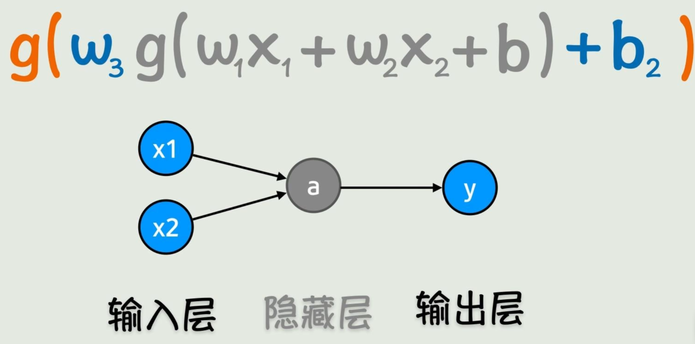

# 理解ai

## 从函数到神经网络

### 函数

**函数**: 这个世界逻辑和知识都可以用函数来表示 "functions describe the world!"

#### 符号主义
**符号主义**: 人工智能早期的思路
现实世界 -> 符号化x -> 设置好规则(函数) -> 运算出结果y -> 解释现实世界
如: 输入直角边边长ab -> 根据勾股定理 -> 计算出斜边边长

**问题**: 不知道符号间的规律
很多东西不知道怎么写成明确的函数 （人太菜了导致的）
如: 识别猫和狗, 可以一眼看出, 但是无法写出一个函数识别

#### 联结主义
**联结主义**: 猜和简化问题
找不到精确函数，就找结果上大差不差的近似函数
不严谨但效果就是好

### 神经网络

#### 激活函数

**激活函数**: 线性 -> 非线性
线性函数 f(x)=wx+b 不能很好的拟合数据, 数据的趋势是曲线
可以在线性函数外套一个非线性运算, 如 sin(wx+b) 、 e^(wx+b)
非线性函数 f(x)=g(wx+b) 逼近能力更强

**扩展**: 套娃
多个特征：输入可以是多个变量 f(x1,x2) = g(w1·x1+w2·x2+b)
曲线不够拟合: 套多层激活函数 f(x1,x2) = g( w3·g(w1·x1+w2·x2+b) + b2 )
以此类推, 可以构造非常复杂的非线性函数, 理论上逼近任意函连续函数

#### 神经网络

y1 = g(w1·x1+w2·x2+b)
y = g( w3·g( y1 ) + b2 )

**神经网络**: 将x1, x2, y1, y 看成节点, 构造关系图，结构类似于生物神经的传到结构, 节点为神经元

**前向传播**: 分步计算
输入层(x1,x2) -> 隐藏层(y1) -> 输出层(y)

