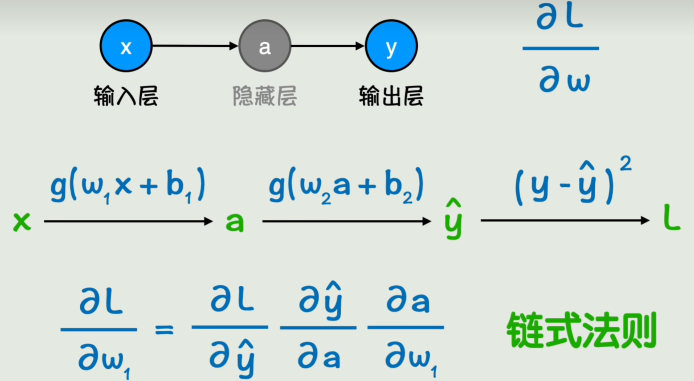
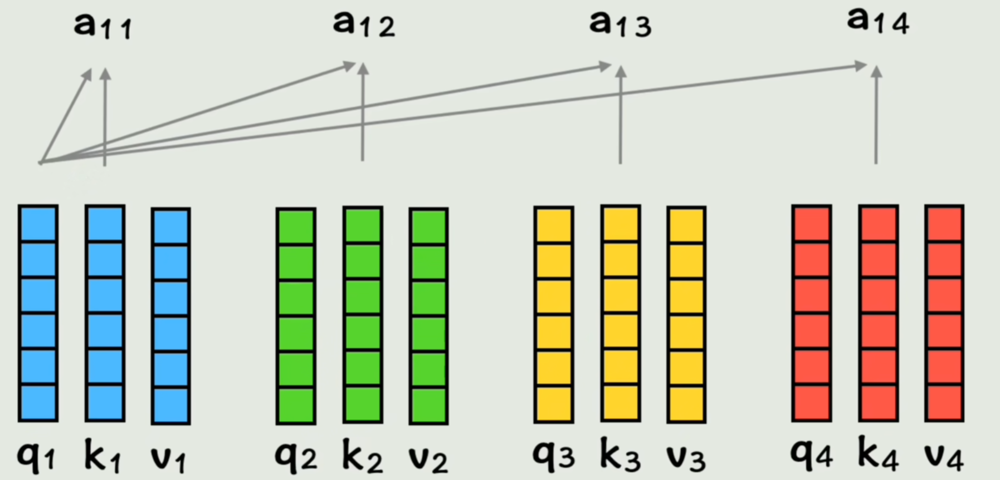

# 理解ai

## 从函数到神经网络

### 函数

**函数**: 这个世界逻辑和知识都可以用函数来表示 "functions describe the world!"

#### 符号主义
**符号主义**: 人工智能早期的思路
现实世界 -> 符号化x -> 设置好规则(函数) -> 运算出结果y -> 解释现实世界
如: 输入直角边边长ab -> 根据勾股定理 -> 计算出斜边边长

#### 联结主义
**问题**: 不知道符号间的规律
很多东西不知道怎么写成明确的函数 （人太菜了导致的）
如: 识别猫和狗, 可以一眼看出, 但是无法写出一个函数识别

**联结主义**: 猜和简化问题
找不到精确函数，就找结果上大差不差的近似函数
不严谨但效果就是好

### 神经网络

#### 激活函数

**激活函数**: 线性 -> 非线性
线性函数 f(x)=wx+b 不能很好的拟合数据, 数据的趋势是曲线
可以在线性函数外套一个非线性运算, 如 sin(wx+b) 、 e^(wx+b)
非线性函数 f(x)=g(wx+b) 逼近能力更强

**扩展**: 套娃
多个特征：输入可以是多个变量 f(x1,x2) = g(w1·x1+w2·x2+b)
曲线不够拟合: 套多层激活函数 f(x1,x2) = g( w3·g(w1·x1+w2·x2+b) + b2 )
以此类推, 可以构造非常复杂的非线性函数, 理论上逼近任意函连续函数

#### 神经网络

y1 = g(w1·x1+w2·x2+b)
y = g( w3·g( y1 ) + b2 )

**神经网络**: 将x1, x2, y1, y 看成节点, 构造关系图，结构类似于生物神经的传到结构, 节点为神经元

**前向传播**: 分步计算
输入层(x1,x2) -> 隐藏层(y1) -> 输出层(y)

## 神经网络参数

### 损失函数

**任务**: 拟合的好
对于函数 f(x) = wx+b
根据一组组(x1, y1), (x2, y2)...的值, 求出 w, b 要求计算的估计值y_test接近y
即: 误差 |y-y_test| 小

**损失函数**: 反应整体数据误差的函数
如: 对每组数据的误差就和 L = sum( |y-f(x)| )

**经典损失函数**:
均方误差: L = sum( (y-f(x))^2 )/N
为了消除绝对值不平滑、分类讨论等问题, 可以用平方消除绝对值, 还可以放大误差大的数据的影响
为了消除样本数量大小的影响, 可以取平均

### 线性回归

**线性回归**: 寻找线性函数来拟合xy之间的关系

**求解**: 极值点, 偏导为0

**举例**: 简化为 y=wx, 结果是y=x

### 梯度下降

**问题**: 神经网络有线性函数和非线性激活函数套娃出来的, 很难求偏导为0的解

**解决**: 试
先初始化系数, 然后慢慢尝试变化系数, 让误差减小

**梯度下降**: 沿着偏导的反方向(损失函数值减小)变化系数

**学习率**: 控制变化的大小

**链式法则**: 复合函数求导

**反向传播**: 先计算外层偏导进行更新, 在计算内层

**一次训练**: 
y_test = g( w2·g( w1·x+b1 )+b2 )
L = (y-y_test)^2
- 初始化 w1, b1, w2, b2
- 学习率 k
- 前向传播: x -> a -> y_test -> L
- 链式求导
    - L对y_test求偏导: -2y_test = m1
    - y_test对b2偏导: g'(w2·a + b2) = m2
    - y_test对w2偏导: a·g'(w2·a + b2) = m3
    - y_test对a求偏导: w2·g'(w2·a + b2) = m4
    - a对b1求偏导: g'(w1·a + b1) = m5
    - a对w1求偏导: x·g'(w1·a + b1) = m6
- 梯度变化
    - b2 = b2 - k1·m1·m2
    - w2 = w2 - k2·m1·m3
    - b1 = b1 - k3·m1·m4·m5
    - w1 = w1 - k4·m1·m4·m6

## 模型训练

### 模型能力

**目标**: 数据拟合的好, 损失函数较小

**泛化能力**: 在没见过的数据上的预测能力

### 过拟合

**提问**: 损失函数越小越好吗

**过拟合**: 训练集上好, 但预测数据不好
单从预测值与真实值误差来看, 右图更好
但直觉会感觉左图更好, 在没见过的数据上效果更好

**原因**: 想复杂了
原本数据是很简单的规律, 但是模型太复杂了, 吧噪声和随机波动也学会了

**解决**: 降低模型复杂度, 增加数据量

### 数据增强

**数据增强**: 在原有数据中创造更多数据

**方法**: 对图像选择、反转、裁剪、噪声...

**鲁棒性**: 受输入细微变化的影响
通过数据增强, 可以让输入数据细微变化时, 输出效果依然很好

### 训练优化

防止过拟合, 最简单粗暴的方式是提前终止训练, 差不多行了, 不太严谨

**正则化**: 给损失函数添加惩罚项, 抑制野蛮增长
当系数调整后带来的坏处(惩罚项变大)大于益处(损失函数减小), 就拒绝这次系数变化
把 损失函数+惩罚项 看成新的损失函数, 使新损失函数减小
- **惩罚项**:
    - L1正则化: sum( |w| ), L1范数
    - L2正则化: sum( (w)^2 ), L2范数
- **正则化系数**: 控制惩罚项影响大小

**超参数**: 控制参数的参数, 如学习率、正则化系数

**Dropout**: 每次训练随机丢弃一些训练数据, 减小个别数据的影响

- **训练问题**: 
    - **梯度消失**: 网络越深, 梯度反向传播时越来越小(小数越乘越小), 参数更新困难
    - **梯度爆炸**: 梯度数值越来越大, 参数调整幅度失去控制
    - **收敛速度过慢**: 陷入局部最优或者来回震荡
    - **计算开销过大**: 数据规模量太大, 每次完整的前向传播和反向传播非常耗时
- **优化方案**: 
    - **梯度裁剪**: 防止梯度更新过大
    - **残差网络**: 防止深层网络的梯度裁剪
    - **权重初始化/输入数据归一化**: 梯度分布更平滑
    - **动量法/RMSProp/Adam**: 优化器加速收敛
    - **mini-batch**: 数据分割成小批次, 降低单次计算开销

## 从矩阵到CNN

### 矩阵

**问题**: 当网络结构复杂时, 公式会很繁杂
**解决**: 引入矩阵简化公式

**优点**: 矩阵运算可以从分利用GPU并行计算的特性, 加速训练和推理

### 卷积神经网络CNN
**问题**: 不能很好的理解图片的局部模式
对于30*30的图像, 输入就有900个节点, 假设下一层有1000个节点, 就有90万个参数, 而且仅仅是把图片平铺展开, 无法保留像素间的空间关系, 图片的细微变化可能使所有神经元和原来完全不同

**卷积核**: 一个固定的矩阵
在传统的图像处理领域, 该矩阵是已知的, 针对模糊、浮雕、轮廓、锐化等效果有不同的结果
在深度学习领域需要通过训练获得

- **卷积运算**:
    - 从原来图像中取出一小块, 如3*3的矩阵, 数值就是图片灰度值
    - 将该矩阵与卷积核进行运算: 对应位置相乘在求和
    - 遍历运算整个原图片, 形成一个新图像

**卷积神经网络**:将一个全连接层替换成卷积层
减少参数数量、捕捉局部特征
公式上将矩阵乘法改成卷积

**池化层**: 对卷积层后的特征图像降维, 减少计算量, 保留主要特征

## 从词嵌入到RNN

### 词嵌入
**问题**: 计算机识别不了文字

**解决**: 编码
将文字转换成计算机能识别的数字, 一一对应

**编码方式**:
- 一个数字代表一个词: 
    - 维度太低, 相当于一维向量
    - 数字表示本身对语言理解没有任何意义, 无法衡量词与词之间的相关性

- one-hot独热编码: 准备超级大的向量, 每个词对应的向量只有一个位置是1
    - 维度太高, 非常稀疏
    - 每个向量之间正交, 无法找到词与词之间的相关性
    - 每个位置看成特征的话, 每个特征只能表示是或否

- word embedding**词嵌入**: 
    - 维度不高不低, 每个位置依然理解为某个特征, 训练出来的
    - 通过向量之间的**点积**和**余弦相似度**表示向量之间的相关性, 对应两个词之间的相关性

**嵌入矩阵**: 将所有的词向量, 组成一个大矩阵
矩阵每一列为一个词向量, 该矩阵由深度学习的方法训练出来(如word2vec)

**潜空间**: 每个向量的维度非常高, 向量所在空间的维度非常高, 该空间为潜空间

### 循环神经网络RNN

**问题**: 
假设一句话有5个词, 每个词向量维度为300
对于神经网络, 输入层就有1500个节点
- 缺点:
    - 输入太大, 且每句话词语的数量长短不一, 输入不固定
    - 无法体现词之间的先后顺序

**解决**: 一个词一个词计算, 前一个结果影响后一个结果

- **RNN运算**: 
    - 第一个词计算隐藏状态 h1 = g(w1·x1 + b1)
    - 再计算出第一个输出 y1 = g(w3·h1 + b2)
    - 第二个词的隐藏状态受第一个隐藏状态的影响 h2 = g(w1·x2 + w2·h1 + b1)
    - 再计算第二个输出 y2 = g(w3·h2 + b2)
    - 以此类推

- **RNN缺点**:
    - 无法捕捉长期依赖: 信息会随着时间步增多而逐渐丢失, 有些语句恰恰是很远的地方起到了关键作用
    - 无法并行计算: RNN必须按顺序计算
- **一些解决方法**: GRU和LSTM改进
    - 仍然是按照时间步顺序传递
    - 只能缓解不能根治

## Transformer

**问题**: 假设做翻译任务, 将每个词转化成词向量
- 用全连接神经网络, 每个词都没有上下文信息, 且输入长度不一
- 用RNN面临串行计算, 且长期以来困难

### 注意力机制

**位置编码**: 把位置编码加到词向量里, 让每个词包含位置信息

**QKV矩阵**: 
每个新的词向量分别与Wq, Wk, Wv矩阵相乘的得到对应的q, k, v向量

实际是使用矩阵计算, 而不是一个个向量分别计算

**相似度计算**: 以第一个词为例
将第一个词的q向量分别与所有的k向量相乘, 得到与每个词的相似度系数

**包含上下文信息的词向量计算**: 以第一个词为例
将每个词的相似度系数与对应的v向量相乘, 再求和, 得到包含上下文信息的词向量

最终得到一组新的词向量, 包含位置信息和上下文信息

### 多头注意力机制

**问题**: 词与词之间的关系在不同视角下是不同的, 对于注意力机制来说, 如果只通过一种方式计算一次相关性, 灵活性不足

**多头注意力机制**: 
- 通过多组权重矩阵计算多组QKV矩阵, 每组矩阵称为一个头

- 每组QKV都用同样的方式计算出向量

- 将计算的每组计算拼接成新的词向量

### transformer架构

#### 深入注意力机制

**单头注意力机制**: QK矩阵相乘得到相似度系数矩阵, 经过缩放、掩码、softmax后, 与V矩阵相乘得到新词向量矩阵

**多头注意力机制**: QKV通过线性变换拆分为多组, 依次经过注意力机制运算后, 把运算结果拼接起来, 再通过线性运算的到新词向量矩阵

#### transformer架构

**架构**: 由编码器和解码器构成

**训练翻译任务为例**: 
- **编码器**
    - 输入要翻译的文本
    - 词嵌入
    - 位置编码
    - 多头注意力
    - 残差和归一化处理
    - 全连接神经网络
    - 残差和归一化处理
    - 结果作为KV矩阵送入解码器的多头注意力2
- **解码器**
    - 目标输出文本
    - 词嵌入
    - 位置编码
    - 多头注意力1 (需要掩码遮住之后的输出, 模拟真实推理的顺序)
    - 残差和归一化处理
    - 结果作为Q矩阵输入多头注意力2, 与编码器输入的KV运算
    - 残差和归一化处理
    - 全连接神经网络
    - 残差和归一化处理
    - 经过线性变换投射到词表
    - softmax层转换成概率, 表示预测的下一个词的概率分布
    - 通过误差进行反向传播调整各个权重

### 大模型
GPT的底层为transformer的解码器部分, 根据前面的词猜下一个词

## 大模型相关术语

- 思想
    - **符号主义**: 符号化, 找到精确函数
    - **联结主义**: 复杂函数来调参拟合

- 基础底座
    - 数学: 线性代数、微积分、概率论
    - **函数**: 万物皆函数, 用于表示逻辑和知识
    - **神经网络**: 用神经网络表示函数
    - **损失函数**: 反应误差的函数, 以损失函数最小化为目标
    - **反向传播**: 训练参数
    - **MLP**: 经典神经网络结构
    - **CNN**: 用于图像数据的卷积神经网络
    - **RNN**: 用于序列数据处理的循环神经网络
    - **attention**: 注意力机制
    - **transformer**: 基于注意力机制发明的架构

- 模型相关
    - **模型**: 复杂函数
    - **权重**: 模型里的参数
    - **大模型**: 模型里的参数量很大
    - **大语言模型LLM**: 用于自然语言处理的模型
    - **训练**: 调整模型参数的过程
    - **预训练**: 事先训练好一个模型
    - **微调**: 基于预训练模型继续训练, 使模型学会具体任务的过程, 如LoRA、QLoRA等
    - **推理**: 将输入交给模型,运算得到输出的过程
    - **涌现**: 随着参数量增大, 语言能力提升, 并产生了推理能力, 这种量变引起质变产生之前没有的能力的现象

- 模型改善
    - **模型压缩**: 让模型变小, 减小成本、方便个人使用的模型压缩方法. 
        - **量化**: 降低数据精度(int64->int32)
        - **蒸馏**: 用参数就大的大模型指导参数较小的模型的训练
        - **剪枝**: 减少模型不重要的神经元部分, 让模型更稀疏, 以提高速度
    - **思维链**: 从推理能力方向增强模型能力的方式
    - **RLHF**: 通过人类反馈的强化学习, 让模型回答更符合人的方法

- 应用相关
    - **生成式AI**: 根据输入自动生成新内容的AI, 包括文本、图像、声音、视频
    - **Token**: 最小粒度的词(词向量)
    - **上下文**: 对话时输入给模型的所有信息
    - **提示词Prompt**: 指导模型回答流程和风格, 实际就是上下文，**提示词工程师/教程**就是学习如何和模型对话 
    - **随机性**: 模型输出的随机性, 不是固定的(概率最高的那个词)
    - **温度temperature**: 控制输出随机性的参数
    - **Top-K**: 控制从概率最高的前K个词里选择
    - **幻觉**: 随机性太高模型容易胡说八道, 太低又过于保守也可能说错. 语言上说的通, 但在事实上错误的情况
    - **联网**: 为了解决幻觉问题, 让模型在回答前从网上查找一些相关信息作为上下文输入给模型, 再回答
    - **检索增强生成RAG**: 有些信息网上查不到, 或者企业的数据不方便公开的放在互联网上, 希望模型从私有的数据库中查找答案
    - **知识库**: RAG的私有数据库
    - **向量数据库**: 知识会以向量的形式存放在数据库中
    - **词嵌入**: 把文字转换成词向量的方式
    - **向量检索**: 对比词之间的相似度, 从向量数据库中查找答案的过程

- 工作流与智能体
    - **工作流**: 多个步骤编排成一个流程, 多次使用模型
    - **扣子Coze**: 在页面上进行傻瓜操作编排工作流的工具
    - **LangChain**: 用代码的方式编排工作流的框架
    - **智能体**: 按照工作流封装大模型和工具集, 用于自动完成某一类复杂任务的程序. 如chatgpt的**插件**系统、**AutoGPT**、**Manus**
    - **多智能体**: 多个智能体互相合作, 完成更复杂任务的程序
    - **MCP**: 为了更方便操作外部数据源和工具, 为AI系统提供标准化的接口或协议, 给予AI操作外部世界的统一标准
    - **A2A**: 用于agent之间通信的协议

- 产业生态
    - **ChatGPT**: 用于聊天的产品
    - **GPT**: ChatGPT背后使用的大语言模型
    - **OpenAI**: 开发ChatGPT的公司
    - **闭源模型**: 不开放代码、权重, 只对外提供服务
    - **开源模型**: 开放模型权重, 可以下载到本地部署的模型. 实际只开放了权重, 不开放代码和数据, 更准确的是**开放权重**模型, 如deepseek
    - **完全开源**: 开放训练代码、模型权重
    - **私有化部署**: 把模型下载到本地使用
    - **镜像**: 打包好的环境和软件
    - **云桌面**: 使用镜像的平台

- 内容创作
    - **PGC**: 由专业机构(如影视公司、媒体机构、权威专家等)创作的内容
    - **UGC**: 随着自媒体时代的到来, 普通用户创造的内容
    - **AIGC**: AI创作或辅助创作的内容
    - **通用人工智能AGI**: 人们对人工智能最终形态的畅想
    - **多模态**: 处理多种模式的能力, 如文本、图片、视频、音频等

- 技术领域
    - **NLP自然语言处理**: 与文字相关的. 如chatgpt、claude、Gemini、DeepSeek、豆包、通义千问、腾讯元宝等
    - **CV计算机视觉**: 与图片相关. 如ai绘画Midjourney、Stable Diffusion, 绘画工作流软件ComfyUI等
    - 语音相关: 文本转文字TTS, 语音转文字ASR
    - 视频相关: 视频生成Sora、可灵、即梦等, 数字人

- 硬件软件
    - **GPU**: 显卡, 加速处理
    - **CUDA**: 配套的开发框架
    - 专门用于人工智能的处理器
        - **TPU**: 专门用于神经网络推理与训练
        - **NPU**: 专门用于终端设备推理ai加速
    - **python**: 适合ai的编程语言
    - **pytorch/TensorFlow**: 针对ai编程的库
    - **Hugging Face**: ai开源平台和社区
    - **Ollama**: 本地运行大模型的工具
    - **vLLM**: 提高大模型推理速度的推理引擎

    

