# paddle 深度学习框架学习

## 线性代数补充
- 向量一般指列向量

- 矩阵求导
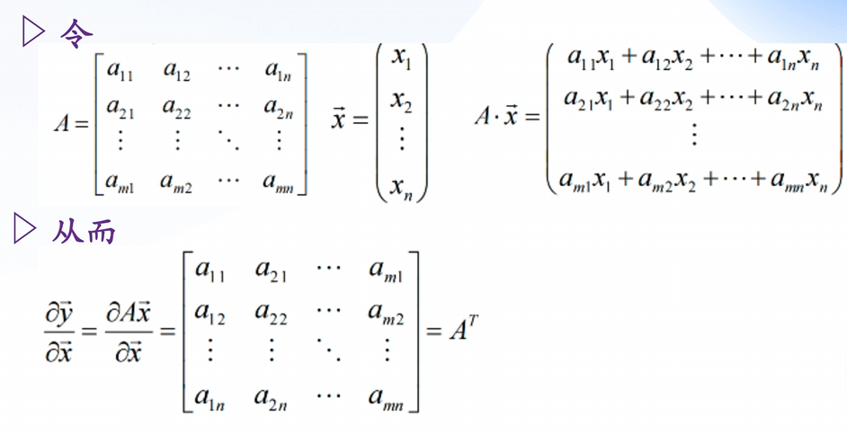

- 矩阵求导推广
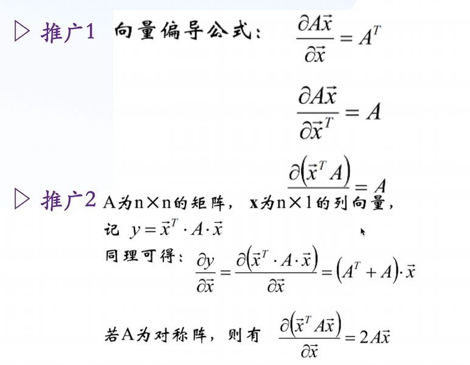

## 1 Machine Learning 机器学习
每个算法都有对应的假设函数、目标函数、优化方法

### 以房价预测为例
两个变量：大小、房间数
标签：房价
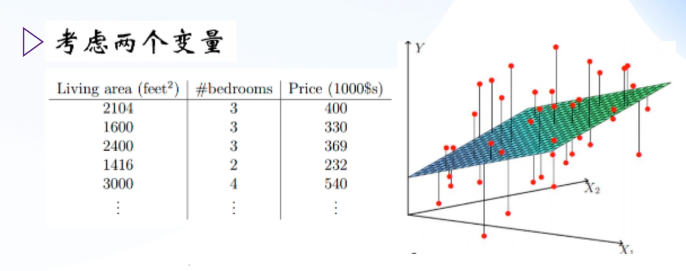

- 确立假设函数
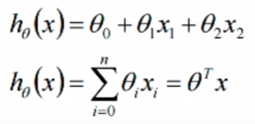

- 寻找目标函数
根据训练样本 (x1,y1)...(xn,yn) 确定出近似函数 appro_y
近似函数与实际函数中间存在误差，可以找到损失函数 loss
损失值越小，预测越好
这个损失函数就是目标函数
最小二乘法为例
我们的目标就是找到系数值使得目标函数最小
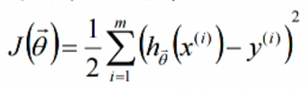

- 定位优化方法
使用梯度下降求**极值**（偏导等于），计算出系数
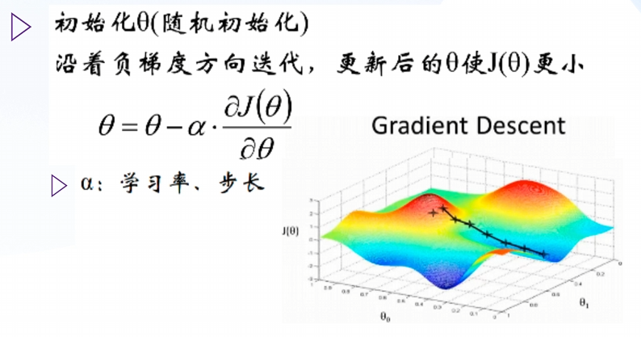

### sklearn分类（以水果分类为例）
scikit算法库流程

- 加载数据集
```python 
import numpy as np      # 科学计算库
import matplotlib.pyplot as plt # 可视化函数
import pandas as pd     # 数据分析工具
import seaborn as sns   # 高级可视化工具
from sklearn.model_selection import train_test_split    # 分割数据集

fruit_df = pd.read_table("fruit_data_with_colors.txt")
print(fruit_df.head(3))
fruit_name_dict = dict(zip(fruit_df["fruit_label"], fruit_df["fruit_name"]))
print("-------------")
print(fruit_name_dict)
```
```
# 结果：
   fruit_label fruit_name fruit_subtype  mass  width  height  color_score
0            1      apple  granny_smith   192    8.4     7.3         0.55
1            1      apple  granny_smith   180    8.0     6.8         0.59
2            1      apple  granny_smith   176    7.4     7.2         0.60
-------------
{1: 'apple', 2: 'mandarin', 3: 'orange', 4: 'banana'}
```

- 分割数据集
```python
X = fruit_df[["mass", "width", "height", "color_score"]] # 建立特征矩阵
Y = fruit_df["fruit_label"] # 标签矩阵
# 分割数据集：random_state随机种子保证可复现
X_train, X_test, Y_train, Y_test = train_test_split(X, Y, test_size=1/4, random_state=0)

print("数据集总共：{}, 训练集：{}, 测试集：{}".format(
    len(X), len(X_train), len(X_test)
))
# 数据集总共：56, 训练集：42, 测试集：14

# 可视化查看特征变量
sns.pairplot(data=fruit_df, hue="fruit_name", vars=["mass", "width", "height", "color_score"])
plt.show()
```

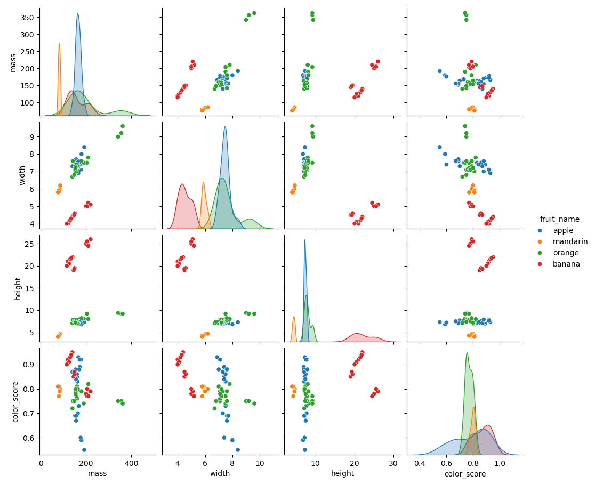

- 建立模型
```python
from sklearn.neighbors import KNeighborsClassifier  # KNN分类器算法库
knn = KNeighborsClassifier(n_neighbors=5)
```

- 训练模型
```python
knn.fit(X_train, Y_train)
```

- 预测模型
```python
Y_pred = knn.predict(X_test)
print(Y_pred)
# [4 1 1 3 1 1 1 4 4 3 2 1 3 3]

from sklearn.metrics import accuracy_score  # 准确率
acc = accuracy_score(Y_test, Y_pred)
print(acc)
# 准确率0.7142857142857143
```

```python
# 比较k对准确率的影响
k_range = range(1, 20)
acc_score = []

for k in k_range:
    knn = KNeighborsClassifier(n_neighbors=k)
    knn.fit(X_train, Y_train)
    acc_score.append(knn.score(X_test, Y_test))

plt.figure()
plt.xlabel("k")
plt.ylabel("accuracy")
plt.scatter(k_range, acc_score)
plt.xticks([0,5,10,15,20])
plt.show()
# k = 1,2,3时准确率最大
```
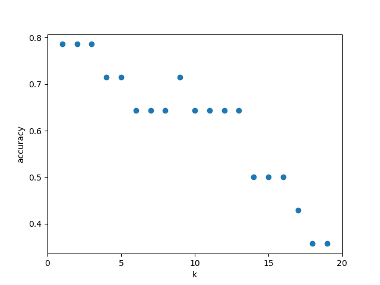


### sklearn 回归（以销售额数据为例）
- 加载数据集
```python 
import csv
import numpy as np      # 科学计算库
import matplotlib.pyplot as plt # 可视化函数
import matplotlib as mpl
import pandas as pd     # 数据分析工具
import seaborn as sns   # 高级可视化工具
from sklearn.model_selection import train_test_split    # 分割数据集
from sklearn.linear_model import LinearRegression

data = pd.read_csv("data.csv")
x = data[["TV", "Radio", "Newspaper"]]
y = data["Sales"]
print(x.head(5))
```
```
# 结果：
      TV  Radio  Newspaper
0  230.1   37.8       69.2
1   44.5   39.3       45.1
2   17.2   45.9       69.3
3  151.5   41.3       58.5
4  180.8   10.8       58.4
```

```python
# 分析数据
mpl.rcParams["font.sans-serif"] = ["simHei"]    # 防止乱码
mpl.rcParams["axes.unicode_minus"] = False
# plot(横轴向量， 纵轴向量)
plt.plot(data["TV"], y, "ro", label="TV")
plt.plot(data["Radio"], y, "g^", label="Radio")
plt.plot(data["Newspaper"], y, "mv", label="Newspaper")
plt.title("线性回归对于多媒体与广告的销售数据", fontsize=16)
plt.legend(loc = "lower right")   # 标签位置
plt.grid()
plt.show()
```
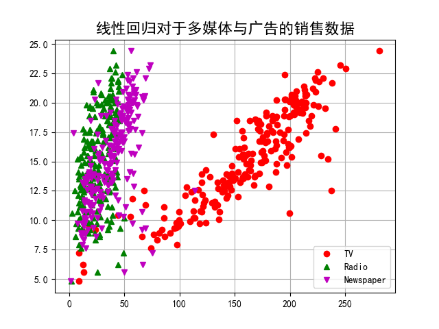


- 分割数据集
```python
x_train, x_test, y_train, y_test = train_test_split(x,y,random_state=1)
```

- 建立模型
```python
linreg = LinearRegression()
```

- 训练模型
```python
model = linreg.fit(x_train, y_train)
print("Linereg0 = ", linreg.coef_)
# Linereg0 =  [0.05904274 0.1046685  0.05113963]
print("Linereg截距项 = ", linreg.intercept_)
# Linereg截距项 =  1.005635540428223
# y_pred = 0.06*x1 + 0.105*x2 + 0.05*x3 + 1.01
```

- 预测模型
```python
y_pred = linreg.predict(np.array(x_test))
mse = np.average((y_pred - np.array(y_test))**2) # 平方和损失
rmse = np.sqrt(mse)

print("RMSE = ", rmse)
# RMSE =  1.2930884632246415

t=np.arange(len(x_test))
mpl.rcParams["font.sans-serif"] = ["simHei"]    # 防止乱码
mpl.rcParams["axes.unicode_minus"] = False
plt.plot(t, y_test, "r-", linewidth=2, label="test")
plt.plot(t, y_pred, "g-", linewidth=2, label="predict")
plt.title("线性回归对多媒体与广告额销售数据", fontsize=16)
plt.legend(loc = "upper right")   # 标签位置
plt.grid()
plt.show()
```

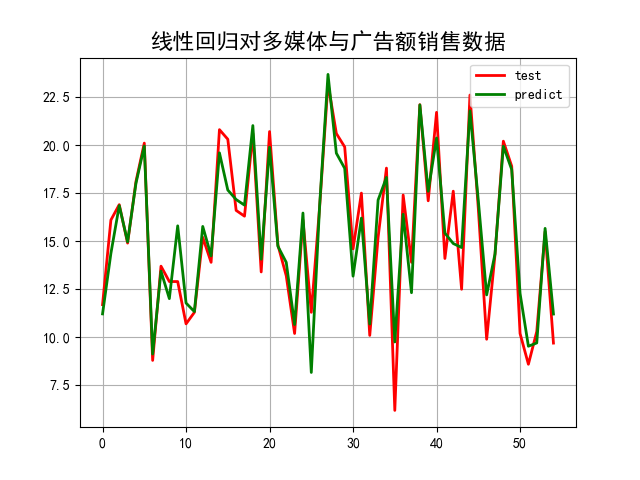


## 2 paddle构建模型

### 深度学习
- 相比于机器学习的优点
    - 用到计算图
    - 偏导计算简便
    - 移植GPU、CPU更简单
    - 运行高效
- 本质
    - 用简单的网络逼近复杂的网络
    - 从大量无标签的样本找到数据的特征

### 环境搭建
- 查看cuda配置
```bash
nvcc --version
```

```
nvcc: NVIDIA (R) Cuda compiler driver
Copyright (c) 2005-2024 NVIDIA Corporation
Built on Wed_Oct_30_01:18:48_Pacific_Daylight_Time_2024
Cuda compilation tools, release 12.6, V12.6.85
Build cuda_12.6.r12.6/compiler.35059454_0
```

- 查看显卡使用情况
```bash
nvidia-smi
```

```
+-----------------------------------------------------------------------------------------+
| NVIDIA-SMI 561.17                 Driver Version: 561.17         CUDA Version: 12.6     |
|-----------------------------------------+------------------------+----------------------+
| GPU  Name                  Driver-Model | Bus-Id          Disp.A | Volatile Uncorr. ECC |
| Fan  Temp   Perf          Pwr:Usage/Cap |           Memory-Usage | GPU-Util  Compute M. |
|                                         |                        |               MIG M. |
|=========================================+========================+======================|
|   0  NVIDIA GeForce RTX 3050 ...  WDDM  |   00000000:01:00.0  On |                  N/A |
| N/A   50C    P0             10W /   65W |    1377MiB /   4096MiB |      3%      Default |
|                                         |                        |                  N/A |
+-----------------------------------------+------------------------+----------------------+
```

- 环境搭建
```bash
conda create -m mypaddle python=3.10
conda activate mypaddle
# 安装cudatoolkit 11.8
conda install -c conda-forge cudatoolkit=11.8
# 如果你需要cudnn（用于深度学习）
conda install -c conda-forge cudnn=8.4.1
pip install paddlepaddle-gpu==2.6.2 -i https://www.paddlepaddle.org.cn/packages/stable/cu118/
```

- 验证环境
```python
import paddle
print(paddle.__version__)
# 检查CUDA是否可用
print("CUDA是否可用:", paddle.device.is_compiled_with_cuda())

# 获取CUDA版本
if paddle.device.is_compiled_with_cuda():
    # 获取CUDA运行时版本
    print(paddle.version.cuda())
    
    # 获取当前设备信息
    print("GPU设备数量:", paddle.device.cuda.device_count())
    
    # 显示GPU设备名称
    for i in range(paddle.device.cuda.device_count()):
        print(f"设备 {i} 名称:", paddle.device.cuda.get_device_name(i))
```

```
2.6.2
CUDA是否可用: True
11.8
GPU设备数量: 1
设备 0 名称: NVIDIA GeForce RTX 3050 Ti Laptop GPU
```

### paddlepaddle流程

#### 波士顿房价预测

- 加载库文件
```python
import paddle
import paddle.nn as nn
from paddle.nn import Linear
import numpy as np
import os
import pandas as pd
import random

```

- 预处理数据
```python
# 数据预处理
def load_data():
    ## 加载数据集
    df =  pd.read_csv("BostonHousing.csv")
    features = list(df.columns)
    datas = df.values

    ## 数据集划分
    radio = 0.8
    offset = int(datas.shape[0] * radio)
    train_data = datas[:offset]
   
    ### 计算train数据集的最大值，最小值，平均值
    ### axis=0列处理
    maximuns = train_data.max(axis=0)
    minimus = train_data.min(axis=0)
    avgs = train_data.sum(axis=0)/train_data.shape[0]
    
    global max_values, min_values, avg_values
    max_values = maximuns
    min_values = minimus
    avg_values = avgs

    ## 数据归一化处理  min-max 归一化
    for i in range(len(features)):
        datas[:, i] = (datas[:, i] - minimus[i]) / (maximuns[i] - minimus[i])

    # 训练集和测试及划分  
    train_data = datas[:offset]
    test_data = datas[offset:]

    return train_data, test_data

```
**注意：**归一化（或标准化）时只用训练集的最大值、最小值、均值等统计量，这是为了防止“数据泄漏”，这样做可以保证模型在实际应用时，只依赖训练阶段获得的归一化参数，和真实场景一致。


- 搭建神经网络
```python
class Regressor(nn.Layer):
    ## 定义网络层
    def __init__(self):
        super(Regressor, self).__init__()
        ## 定义一层全连接层，输出维度为1，不适用激活函数
        self.fc = Linear(in_features=13, out_features=1)

    ## 前向计算forward
    def forward(self, inputs):
        x  = self.fc(inputs)
        return x
```

- 配置训练
```python
# 配置训练
## 声明模型实例
model = Regressor() 
### 开启训练模式
model.train()   
## 加载训练和测试数据
train_data, test_data = load_data()
## 设置优化算法和学习率
### 优化器
opt = paddle.optimizer.SGD(learning_rate=0.01, parameters=model.parameters())
```

- 训练模型
    - 训练状态.train()
    - 预测状态.eval()

采用内外层循环：假设数据集样本1000，一个批次(batch)有10个样本，批次数量100 (10/100)

```python
epoch_num = 10
batch_size = 10

for epoch_id in range(epoch_num):
    ## 数据准备
    ### 打乱训练集
    np.random.shuffle(train_data)
    ### 数据拆分：0-10一组，10-20一组...
    mini_batches = [train_data[k:k+batch_size] for k in range(0, len(train_data), batch_size)]

    for iter_id, mini_batche in enumerate(mini_batches):
        ### 划分特征和标签
        x = np.array(mini_batche[:, :-1]).astype("float32")
        y = np.array(mini_batche[:, -1]).astype("float32")
        ### 转换成动态图
        house_feature = paddle.to_tensor(x)
        prices = paddle.to_tensor(y)

        ## 前向计算
        predict = model(house_feature)

        ## 计算损失
        loss = paddle.nn.functional.mse_loss(predict, label=prices)
        avg_loss= paddle.mean(loss)

        if iter_id%20 == 0:
            print(f"epoch:{epoch_id}, iter:{iter_id}, loss:{avg_loss.numpy()}")

        ## 反向传播: 梯度下降
        avg_loss.backward()
        opt.minimize(avg_loss)  # 最小化loss，更新参数
        model.clear_gradients() # 消除梯度
```

- 保存测试文件
```python
## 保存模型
paddle.save(model.state_dict(), "PPStudy/demo/sale_predict/LR_model.pdparams")
print("模型保存成功")

## 推理测试
## 推理测试
def load_one_example():
    df = pd.read_csv("PPStudy/demo/sale_predict/BostonHousing.csv")
    datas = df.values

    ### 选择倒数第10行数据用于测试
    one_data = datas[-10]

    ### 归一化
    for i in range(len(one_data)-1):
        one_data[i] = (one_data[i] - min_values[i]) / (max_values[i] - min_values[i])

    data = np.reshape(np.array(one_data[:-1]), [1,-1]).astype(np.float32)
    label = one_data[-1]
    return data, label

### 加载模型
model_dict = paddle.load("PPStudy/demo/sale_predict/LR_model.pdparams")
model.load_dict(model_dict)
model.eval()    # 预测状态

### 加载测试集
test_data, label = load_one_example()
test_data = paddle.to_tensor(test_data)
results = model(test_data)

### 反归一化处理
results = results * (max_values[-1] - min_values[-1]) + min_values[-1]
print(f"infer: {results.numpy()}, label:{label}")
# infer: [[21.360323]], label:19.7
```

## 3 深度学习的单层神经网络

### 单层神经网络

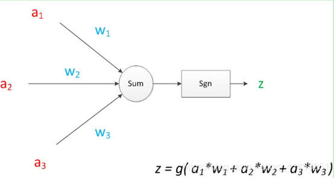

### 神经计算图

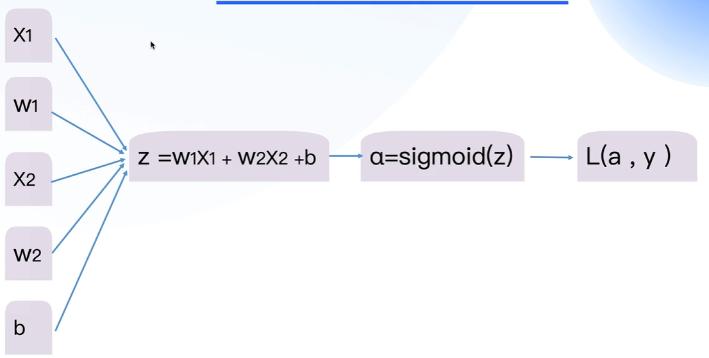

### softmax多分类

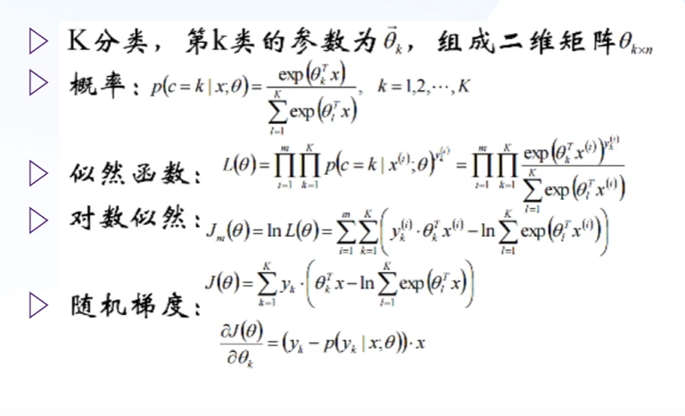
