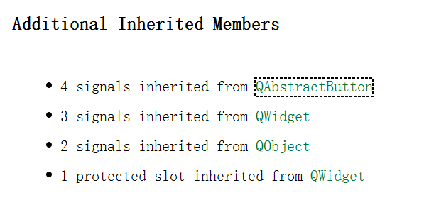
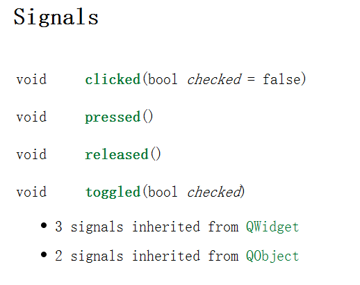
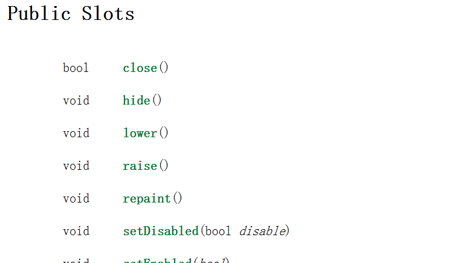
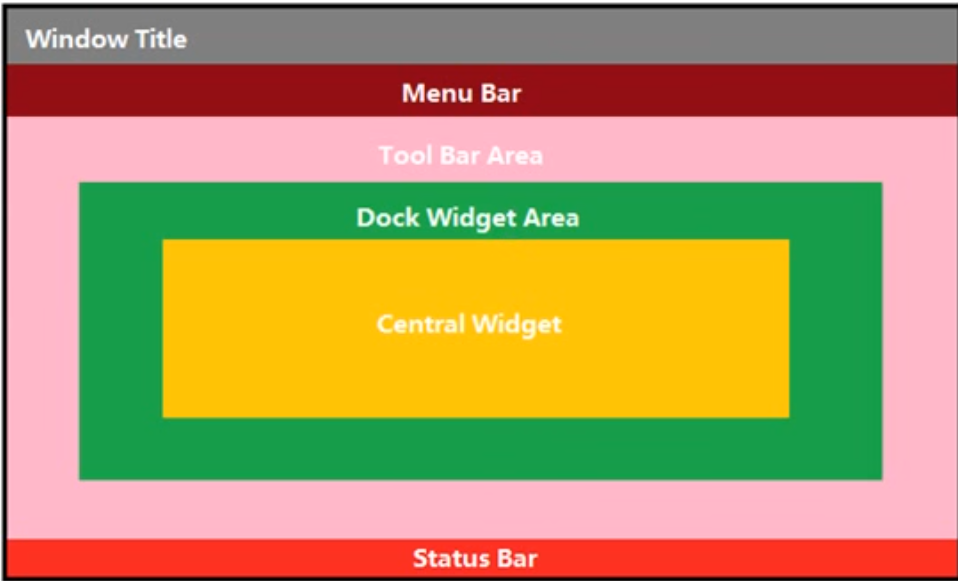

# Qt笔记

## 第一天

#### 快捷键

注释 ctrl + /
允许 ctrl + r
编译 ctrl + b
查找 ctrl + f
帮助文档 f1
自动对齐 ctrl + i
.h和.cpp切换 f4

#### 按钮Button

QPushButton 继承于 Widget

- **显示**：
  - show()：以顶层方式弹出窗口控件，按钮不这么用

```cpp
    // 创建按钮
    QPushButton *btn1 = new QPushButton;
    //把按钮放进窗口
    btn1 -> setParent(this);
    //显示文本
    btn1 -> setText("第一个按钮");

    //按照控件大小创建窗口
    QPushButton *btn2 = new QPushButton("第二个按钮", this);
    //设置大小
    btn2 -> resize(200,100);
    //移动按钮位置
    btn2 -> move(100,100);

    //重置窗口大小
    resize(1000,800);
    //固定窗口大小
    setFixedSize(1000,800);
    //设置标题
    setWindowTitle("第一个窗口");
```

#### 对象树(对象模型)

qt创建对象时会提供parent指针

- **QObject**: 创建一个QObject对象时，可以提供一个父对象( **setParent()函数** )，创建的对象由父对象的children()列表管理(构造、析构)
  - 注意：区别父类(这里不是继承父对象)
  - 构造：自顶向下
  - 析构：自底向上
- **QWidget**: 继承自QObject，有对象树关系

#### 创建自己的类

右键项目根目录，选择添加新文件，选择父类（没有直接父类就选择间接的，在自己的类里改就行）

```cpp
//MyPushButton.h
#ifndef MYPUSHBUTTON_H
#define MYPUSHBUTTON_H

#include <QPushButton>

class MyPushButton : public QPushButton
{
    Q_OBJECT
public:
    explicit MyPushButton(QWidget *parent = nullptr);

    ~MyPushButton();

signals:

};

#endif // MYPUSHBUTTON_H
```
```cpp
//MyPushButton.cpp
#include "mypushbutton.h"
#include<QDebug>

MyPushButton::MyPushButton(QWidget *parent) : QPushButton(parent)
{
    qDebug() << "我的按钮的构造函数" << endl;
}

MyPushButton::~MyPushButton()
{
    qDebug() << "我的按钮的析构函数" << endl;
}
```
```cpp
//使用
    //我的按钮
    MyPushButton *btn3 = new MyPushButton;
    btn3 -> setParent(this);
    btn3 -> setText("我的按钮");
    btn3 -> move(200,0);
```

#### qt坐标系

左上角(0,0)，x正右，y正下

#### 信号(signals)和槽(slot)

connect(信号的发送者, 具体信号, 信号接收者, 信号的处理(槽))
优点：低耦合

```cpp
    //需求 点击我的按钮关闭窗口
    connect(btn3, &MyPushButton::clicked, this, &Widget::close );
    //用父类
    connect(btn3, &QPushButton::clicked, this, &QWidget::close );
```

**查找信号**:
子类可能没有信号变量，在父类里

点击父类，查看信号的具体成员


**查找槽**：


**自定义信号的槽**：下课老师饿了(信号),让学生请客吃饭(槽)
```cpp
//老师

class Teacher : public QObject
{
    Q_OBJECT
public:
    explicit Teacher(QObject *parent = nullptr);

signals:
    //自定义信号
    //返回值void,只声明不实现
    //可以有参,重载
    void hungry();

};
```
```cpp
//学生

//.h
class Student : public QObject
{
    Q_OBJECT
public:
    explicit Student(QObject *parent = nullptr);

    //槽slots
    //返回void,需要声明,需要实现
    //可以有参数,可以重载
    void treat();

signals:

};

//.cpp
void Student::treat()
{
    qDebug() << "请老师吃饭" << endl;
}
```
```cpp
//窗体

//.h
class Widget : public QWidget
{
    Q_OBJECT    //宏，允许使用信号的槽机制

public:
    Widget(QWidget *parent = nullptr);
    ~Widget();

private:
    Ui::Widget *ui;
    Teacher *zt;
    Student *st;

    void classIsOver();
};

//.cpp
    //创建老师对象
    this->zt = new Teacher(this);
    //创建学生对象
    this->st = new Student(this);
    //老师饿了让学生请客吃饭
    connect(zt, &Teacher::hungry, st, &Student::treat );
    //调用下课
    classIsOver();

//下课实现
void Widget::classIsOver()
{
    //下课函数，调用后触发饿了信号
    emit zt->hungry();
}  
```

**重载信号和槽**：需要用函数指针

```cpp
//老师
    //重载
    void hungry(QString foodName);
```
```cpp
//学生

//.h
    //重载
    void treat(QString foodName);

//.cpp
void Student::treat(QString foodName)
{
    //foodName不带引号
    //QString -> char*
    //先转成QByteArray(.toUtf8()), 在转char*
    qDebug() << "请老师吃饭,老师要吃:" << foodName.toUtf8().data() << endl;
}
```
```cpp
//窗体
    //连接代参数的信号和槽
    //函数指针 -> 函数地址
    void(Teacher:: *teacherSignal)(QString) = &Teacher::hungry;
    void(Student:: *studentSlot)(QString) = &Student::treat;
    connect(zt, teacherSignal, st, studentSlot);
    classIsOver();

void Widget::classIsOver()
{
    //下课函数，调用后触发饿了信号
    emit zt->hungry("宫保鸡丁");
}
```

**按钮触发下课**：
```cpp
    //点击按钮下课
    QPushButton *btn = new QPushButton("下课", this);
    connect(btn, &QPushButton::clicked, this, &Widget::classIsOver );
```

**信号连接信号**:
```cpp
    //点击按钮下课
    QPushButton *btn = new QPushButton("下课", this);

    //无参信号和槽连接
    void(Teacher:: *teacherSignal2)(void) = &Teacher::hungry;
    void(Student:: *studentSlot2)(void) = &Student::treat;
    connect(zt, teacherSignal2, st, studentSlot2);
    //信号连接信号
    connect(btn, &QPushButton::clicked, zt, teacherSignal2 );
```

**断开信号**:
```cpp
    //断开信号
    disconnect(zt, teacherSignal2, st, studentSlot2);
```

- **补充**:
  - 信号可以连接信号
  - 一个信号可以连多个槽
  - 多个信号可以连同一个槽
  - 信号和槽函数的参数必须一一对应，
  - 信号参数个数可以多余和槽函数的，槽函数不接收多余的

#### Lambda表达式

\[](){}

- **开始**：[]
  - 参数：
    - 空：不使用任何函数对象参数
    - = ：函数体可以使用表达式所在范围的所有可见局部变量（值传递）
    - & ：引用传递
    - this：同=
    - 变量名a1,a2...：值传递a1,a2
- **匿名函数参数**：(参数)
- **可修改标识符**：()mutable{}, 可修改局部变量传入的形参
- **返回值**：()->返回数据类型{}

```cpp
    //用lambda实现点击发送老师饿了信号
    QPushButton *btn2 = new QPushButton("关闭", this);
    btn2 -> move(100,100);

    //this可省略
    connect(btn2, &QPushButton::clicked, this, [=](){
        emit zt->hungry("宫保鸡丁");
    });
```

## 第二天



#### 菜单
菜单栏QMenuBar, 菜单QMenu, 菜单项QAction
```cpp
    //菜单栏最多只有一个
    //创建菜单栏
    QMenuBar *bar = menuBar();
    //放入
    setMenuBar(bar);

    //创建菜单
    QMenu *fileMenu = bar->addMenu("文件");
    QMenu *editMenu = bar->addMenu("编辑");

    //菜单项
    QAction *newAction =  fileMenu->addAction("新建");
    //添加分隔线
    fileMenu->addSeparator();
    QAction *openAction = fileMenu->addAction("打开");
```

#### 工具栏
工具栏QToolBar, 工具项QAction、控件(按钮等)
```cpp
    //工具栏 可以有多个
    QToolBar *toolBar = new QToolBar(this);
    //添加工具栏, 默认左边
    addToolBar(Qt::LeftToolBarArea, toolBar);
    //只允许左右停靠
    toolBar->setAllowedAreas(Qt::LeftToolBarArea | Qt::RightToolBarArea);
    //设置浮动
    toolBar->setFloatable(false);
    //设置移动(总开关):能否移动
    toolBar->setMovable(false);

    //工具栏添加内容
    toolBar->addAction(newAction);
    //分割线
    toolBar->addSeparator();
    toolBar->addAction(openAction);
    //添加控件
    QPushButton *btn1 = new QPushButton("按钮", this);
    toolBar->addWidget(btn1);
```

#### 状态栏
状态栏QStatusBar, 内容QLabel(标签控件)
```cpp
    //状态栏 只能有一个
    QStatusBar *stBar = statusBar();
    //设置到窗口
    setStatusBar(stBar);
    //从左侧标签控件
    QLabel *label1 = new QLabel("提示信息",this);
    stBar->addWidget(label1);
    //从右侧放
    QLabel *label2 = new QLabel("右侧提示信息",this);
    stBar->addPermanentWidget(label2);
```

#### 浮动窗口
浮动窗口QDockWidget
```cpp
    //铆接部件(浮动窗口)
    QDockWidget *dockWidget = new QDockWidget("浮动", this);
    addDockWidget(Qt::BottomDockWidgetArea, dockWidget);
    //只允许上下
    dockWidget->setAllowedAreas(Qt::TopDockWidgetArea | Qt::BottomDockWidgetArea);

```

#### 核心窗口
文本编辑QTextEdit
```cpp
    //设置核心部件 
    //文本编辑器
    QTextEdit *edit = new QTextEdit(this);
    setCentralWidget(edit);
```

#### 资源文件
创建文件：右键项目添加文件 -> 选择Qt -> resource file -> 创建
添加资源：写前缀 -> 选文件
使用资源：: + 前缀名 + 文件名

#### 对话框
- 模态与非模态对话框：QDialog
  - 模态：不可以操作其他窗口
  - 非模态：可以
```cpp
    //模态
    QDialog dlg(this);
    dlg.resize(200,100);
    dlg.exec();
    qDebug() << "模态对话框弹出";  //会阻塞

    //非模态
    QDialog *dlg2 = new QDialog(this);  //堆区一直存活
    dlg2->resize(200,100);
    dlg2->show();
    dlg2->setAttribute(Qt::WA_DeleteOnClose);   //关闭时删除对象，防止内存泄露
    qDebug() << "非模态对话框弹出"; //不会阻塞
```

- 消息对话框：QMessageBox (静态)
  - 错误critical
  - 信息information
  - 提问question
  - 警告warning
```cpp
    //父亲 标题 内容 按键类型 默认关联回车按键
    //返回点击的按钮
    QMessageBox::critical(this, "critical", "错误");
    QMessageBox::information(this, "info", "信息");
    QMessageBox::question(this, "ques", "提问");
    QMessageBox::warning(this, "warn", "警告");

```

- 其他标准对话框
  - 选择颜色QColorDialog
  - 选择文件或目录QFileDialog
  - 选择字体QFontDialog
  - 输入QInputDialog
  - 打印机配置QPrintDialog
  - ...
