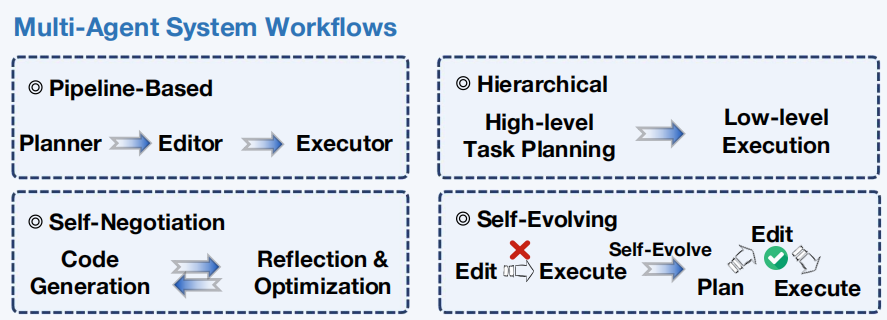

# 综述阅读

## 基于LLM的代码生成智能体

**A Survey on Code Generation with LLM-based Agents**

### 简介

**代码生成**：
  - **定义**: 将用户需求转化为计算机程序
  - **要求**: 语法合法、语义一致、正确运行
  - **意义**: 降低人工编码成本, 提高开发效率, 减少人为错误, 最终达到软件开发自动化
  - **技术局限性**: 上下文理解不足、生成能力有限、通用性和灵活性差
  - **突破**: LLM的出现

**发展**:
  - **程序合成**: 通过形式化**规范**推导出可验证的正确程序
    - 规范化困难
  - **基于深度学习的数据驱动范式**: 将代码生成视为概率序列学习问题
    - 生成的代码功能有限, 包含语法语义错误
  - **LLM**: github庞大的训练数据集, 使模型能够掌握编程语言的语法和语义以及编程算法和范式
    - 缺乏自主分解任务、环境交互、验证纠错能力
  - **基于LLM的代码生成智能体**: 能够自主规划、行动、观察和迭代优化, 模拟人类进行需求分析、代码编写、运行测试、错误诊断和应用修复

**代码生成智能体优势**:
  - **自主性**: 自主管理整个工作流程, 从任务分解到编码调试
  - **扩展任务范围**: 包含完整的软件开发生命周期(SDLC)
  - **实用性**: 工程级代码生成, 系统可靠性、过程管理、工具集成等

### 基础知识

#### LLM 核心特性

**架构**: 以Transformer为核心，通过海量文本预训练学习语言模式

**代码生成领域**: 大量开源代码作为训练数据, 可掌握多语言语法、编程范式, 展示了强大的代码生成和理解能力
  - 代表模型CodeX、CodeLlama、DeepSeek-Coder、Qwen2.5-Coder等
  - 应用于代码补全、测试代码生成、bug修复等全软件开发生命周期

**关键emergent能力**: 规划能力、工具使用能力、环境交互能力. 

#### LLM-based 智能体

以LLM为核心推理引擎，集成了感知、记忆、决策和动作模块

**核心组件**:
   - **规划**: 分解复杂任务
   - **记忆**: 短期记忆(LLM上下文窗口)、长期窗口(RAG + 向量数据库)
   - **工具使用**: 调用外部工具(编译器、搜索引擎等)
   - **反思**: 检查评估并修正自身输出

**LLM 与 LLM-based 智能体的核心差异**:
| 对比维度 | LLM | LLM-based 代码生成智能体 |
|----------------|------------------------------|-----------------------------------------|
| 工作模式 | 单轮被动响应（输入→输出） | 动态自主 workflow（规划→执行→观察→调整）|
| 核心能力 | 上下文生成能力 | 任务分解、工具调用、反思自修正能力 |
| 适用场景 | 简单代码片段生成（函数补全） | 复杂 SDLC 任务（多文件开发、动态调试） |
| 与环境交互 | 无交互 | 可与开发环境（终端、编辑器）持续交互 |

### 关键技术

#### 单智能体代码生成

**规划与推理技术**:

单路径规划 -> 多路径并行推理
线性规划 -> 结构化规划

  - **单路径规划**: 
    - Self-Planning: 首个引入**规划阶段**，先出步骤再生成代码
    - CodeChain: 在规划阶段引入**聚类**和**自修订**, 构建可重用的模块化代码
    - CodeAct: 引入**统一动作空间**, 将动作转化为python代码, 集成Python解释器, 可以立即执行代码, 实时反馈挑调整
    - KareCoder: 融入**专业知识库**（如编程库、学科文献库等）, 注入外部知识
    - WebAgent: 规划机制应用到web自动化场景, 指令分解、HTML内容总结、程序生成
    - CodePlan: 引入**多阶段控制流**和**自定义控制指令**, 推理时动态选择生成或者修改

  - **多路径探索**: 
    - GIF-MCTS: 引入**蒙特卡洛树搜索**, 多路径评分筛选
    - PlanSearch: 首次将规划过程形式化为搜索任务, 并行评估候选计划

  - **结构化规划**: 
    - CodeTree/Tree-of-Code: 将线性规划转为**树结构**, 结合执行反馈剪枝
    - DARS: 采用**多阶段控制**, 引入**分层目标**和**中间奖励信号**, 缓解端到端生成的**目标偏移**问题. 自适应树结构, 关键节点分支新的规划路径, 动态调整规划路径
    - VerilogCoder: 硬件任务中引入基于**抽象语法树**的图结构规划机制和波形跟踪工具, 展示了规划范式在**跨模态**和特定任务中的自适应潜力
    - Guided Search: 提出**一步前瞻one-step lookahead**和**轨迹选择trajectory selection**策略, 解决传统搜索方法难以在**非序列化环境**中应用的挑战
      - 一步前瞻: 提前预测下一步动作
      - 轨迹选择: 根据过去成功过的路径选更有效的

**工具集成与检索增强**:

  - **工具集成**:
    - ToolCoder: 集成**API搜索工具**, 缓解模型**幻觉**导致API调用错误
    - ToolGen: 集成**自动补全工具**, 解决代码生成中的**依赖问题**, 例如变量未定义、成员错误等
    - CodeAgent: 进一步增强**复杂需求**和**复杂依赖关系**, 集成5类编程工具(**网站搜索**、**文档阅读**、**代码符号导航**、**格式检擦器**、**代码解释器**), 支持信息检索、代码生成与测试
    - ROCODE: 工具**反馈机制**方面, 引入**闭环机制**(生成 -> 错误检测 -> 自适应回溯), 结合静态分析定位修改范围
    - CodeTool：增强对工具调用的**逐步控制**, 引入**过程级监督机制**, 监督工具调用步骤, 提高工具调用的准确性和鲁棒性

  - **检索增强(RAG)**
    - RepoHyper: **仓库级向量检索**, 定位可复用代码片段, 提升对**长距离依赖**的把控能力
    - CodeNav: 根据需求检索**真实存储库**, 导入相关函数和代码块, 解决依赖需**预注册**工具问题
    - AUTOPATCH: 应用于**运行时性能优化**问题, 将历史代码示例与控制流图(CFG)分析相结合, 进行上下文感知学习, 通过上下文提示模型优化代码
    - Knowledge Graph Based Repository-Level Code
Generation: 将代码库表示为**知识图谱**, 提高检索上下文的结构化表达能力, 项目级生成任务准确率提升**10%+**
    - cAST: 基于抽象语法树(AST)的**结构化分块**, 提升代码检索的Recall与Pass@1等指标

  
**反思与自改进**: 模仿开发过程的生成、评估、修改过程

自然语言层面的自我反馈 -> 结合执行结果的自动修复 -> 基于程序结构和多解评估的模块级优化

  - **文本级反思**: 
    - Self-Refine: 自然语言自评 -> 迭代修订, 无需额外训练
    - Self-Iteration: 角色分工+结构化迭代框架, 解决**误差累积问题**
    - Self-Debug: 逐行解释定位错误

  - **执行反馈驱动**: 
    - Self-Edit: 结合执行反馈二次编辑代码
    - Self-Repair: 代码模型+反馈模型, 基于测试失败生成修复解释

  - **模块化优化**: 
    - CodeChain: 引入模块化的**自修订框架**, 聚类代表性子模块, 复用经过验证的组件
    - LeDeX: 增强**闭环自调试框架**, 分步标注错误代码, 生成修复方案并收集数据集微调

#### 多智能体代码生成

**多智能体工作流**

  - **Pipeline分工**: 按照SDLC阶段拆分任务, 结构清晰但**串行**依赖
    - Self-Collaboration: **基于瀑布模型**, 需求分析→编码→测试
    - AgentCoder: 程序员→测试设计者→测试执行者
    - CodePori: 引入一组智能体, 包括管理者、开发人员、优化人员、测试人员
      - 管理员: 需求分析、分解任务
      - 开发人员: 多个智能体并行协作, 编写不同模块的代码
      - 优化人员: 多个智能体细化代码
      - 测试人员: 执行集成测试
    - MAGIS: 聚焦**仓库维护**类任务, 包含项目经理、维护人员、开发人员和质量保障人员, 完成github Issue跟踪、分配与修复
    - HyperAgent: 专注于**跨语言**、**跨任务**的代码生成, 包含规划者、导航者、代码编辑器、执行器, 同时引入自动工具链检索机制

  - **分层规划-执行**: 高智能体规划、低智能体执行
    - PairCoder: Navigator 规划 + Driver 实现
    - FlowGen: 模拟瀑布/TDD等软件工程模型，阶段性规划和目标验证
    - SoA: 引入**动态智能体调度**机制, 动态扩展或收缩智能体数量
    - MAGE: 高级目标分解为微操作并将其分配给不同的智能体

  - **自协商循环优化**：多轮交互改进
    - MapCoder: 四智能体循环, 回忆→规划→生成→调试
    - AutoSafeCoder: 编码器、静态安全检测器(静态安全检测)、模糊测试器(动态安全检测)
    - QualityFlow: 生成单元测试 → 检查单元测试合理性 → 执行测试
    - CodeCoR: 引入**自我反思**评分机制, 反思智能体评分定位问题，反馈优化
    - MARCO: 代码生成智能体+性能评估智能体, 不断优化生成的代码性能

  - **自进化结构**：自发、动态调整系统结构
    - SEW: 基于协作效果重组通信路径和职责划分
    - EvoMAC: **文本反向传播**机制, 调整协作策略

  - **角色分工**：通过 Prompt 设定角色
    - ChatDev: 程序员、评审员、测试员
    - MetaGPT: 模拟软件公司组织架构

**上下文管理与记忆技术**

  - Self-Collaboration：首次引入**黑板模型**，基于**共享视图得到协作流**，建立共享内存空间存储任务描述、中间结果等，所有智能体可读写
  - L2MAC：基于**类冯・诺依曼架构**，设计指令寄存器与文件存储模块，突破 LLM 上下文窗口限制，支持多文件生成
  - Cogito：基于**类脑机制**，分为短期记忆（任务状态）、长期知识库（通用知识）、进化增长单元（抽象能力提升），具备自学习能力
  - SoA：引入**自组织内存**，根据任务复杂度动态扩展智能体池，中央控制器保持各智能体上下文对齐，支持大规模代码库生成
  - GameGPT: 采用**双协同**机制，减少冗余的语句重传
  - CleanAgent: 基于 Dataprep.Clean 库构建了一个**声明式 API 记忆模块**，从历史调用轨迹中提取并重用领域知识

**协同优化**

  - Lingma SWEGPT：分三阶段（代码库理解→故障定位→补丁生成），收集多智能体行为数据，通过监督微调优化协同
  - CodeCoR：四智能体（prompt / 代码 / 测试 / 修复）互评估，剪枝低质量输出，迭代提升协同质量
  - SyncMind：解决**状态偏移**问题，通过多维度评估实现失步恢复
  - CANDOR：采用**小组讨论策略**，要求多个审稿人智能体达成共识，再生成

### 应用

- 自动化代码生成与实现
  - 函数级代码生成：Self-Planning、LATS、Lemur、CodeChain、MapCoder、FlowGen、PairCoder、CodeTree、CodeCoR、QualityFlow、CodeSim、DARS、SEW
  - 代码库级代码生成：Self-Collaboration、ChatDev、Webagent、MetaGPT、CodePlan、CoAgents、GamePoW、GameGPT、SoA、ToolGen、AgileCoder、AgileAgent
- 自动化调试与程序修复：Self-Refine、Self-Debug、Self-Edit、Self-Repair、RepairAgent、AutoCodeRover、SWEx-Agent、OrcaLog、PatchPlot、Thinking-Longer、HyperAgent、FixIt、MetaS、AutoSafeCoder、SOLverlntentAgent、Nemorron-CORTEXA
- 自动化测试代码生成
  - 自动化测试用例生成：TestPilot、CANDOR、XUAT-Copilot、LogiAgent、SeedMind、ACH
  - 自动化执行与分析：AUTestAgent、HEPH
- 自动化代码重构与优化
  - 结构化代码重构：DataClump-Pipeline、iSMELL、EM-assist、HaskellAgent
  - 代码性能优化：AIDE、MARCO、LASSI-EE、SysLLMatic
- 自动化需求澄清：MARE、ClarifyGPT、TiCoder、SpecFix、interAgent、HLDe

### 挑战
- 核心能力局限：
  - 缺乏结构化领域知识
  - 意图理解和上下文感知能力不足
  - 跨文件关联理解不足
  - 多模态理解能力不足，无法理解 UI 草图 / 架构图
- 系统鲁棒性：
  - 多智能体**错误级联**：上游错误放大
  - 智能体协调复杂度：交互**指数增长**
  - 知识更新：无法持续学习项目特定标准，**易过时**
- 人机交互与成本：
  - 模型**幻觉**导致可靠性不足
  - 灵活性和安全性问题
  - 高运营成本：多轮交互导致计算 / 时间**开销大**
- 评估与范式：
  - 评估体系不完整
  - 软件开发范式转型：需支持 “软件即服务”，用户仅提供意图

## 图技术与AI智能体

**Graphs Meet AI Agents: Taxonomy, Progress, and Future Opportunities**

### 简介

#### 整体图解

#### ai智能体发展范式迭代

- **强化学习(RL)**驱动：依赖奖励函数优化，通过与环境交互学习特定任务决策（如游戏策略、机器人控制），但缺乏通用知识与复杂推理能力
- **大语言模型(LLM)**驱动：依托大规模预训练的世界知识，具备自然语言理解 / 生成、记忆管理、工具调用能力，可适配多任务无需重复训练（如对话智能体）
- **RL与LLM融合**：以 LLM 为知识骨干，RL 为任务优化范式，兼顾通用推理与任务特异性学习（如 Deepseek-R1 通过 RL 增强 LLM 推理能力）

#### 智能体挑战与图技术价值

**核心挑战**：复杂现实任务，需应对**非结构化信息**（如自然语言指令、多模态环境数据）、**动态操作**（如工具调度、多智能体交互），传统智能体难以显式建模信息 / 操作间的关联

**图技术的解决方案**：**节点-边** -> **实体-关系**，图结构天然适配复杂关联建模，通过**数据组织**（将非结构化数据转化为图结构）与**知识提取**（图神经网络 GNN 等挖掘图中隐含信息），为智能体的规划、执行、记忆、协同提供结构化支撑

### 预备知识

- **ai智能体**：感知环境、**自主决策**以达成目标的模型
- **强化学习RL**：**无监督**、依赖少，通过 **交互-反馈** 循环优化序列决策，适配动态环境（如自动驾驶、游戏）
- **大语言模型LLM**：海量文本预训练学习语言模式，支持自然语言交互、任务规划、工具调用，可通过检索 / 微调更新知识
- **图**：节点-边 的结构
- **图学习**：含**数据组织**与**知识提取**两阶段 
- **双向赋能**：
  - **图赋能智能体**：图技术增强智能体规划、执行、记忆、协同功能
  - **智能体赋能图学习**：智能体优化图标注、合成、理解等任务
- **任务依赖图TDG**：节点为子任务，边为依赖，通常为有向无环图DAG
- **状态空间图SSG**：节点为环境状态，边为行动转移
- **场景图**：将环境中 物体 与 语义/空间关系 建模为图
- **智能体协同图ACG**：节点为智能体，边为通信路径，边权重为信息重要性

### 图技术赋能智能体核心功能

#### 规划功能

规划是智能体将**目标拆解**为有序行动的过程，图技术通过**结构化建模**提升推理、分解、搜索的准确性与效率

**任务推理**：结构化思考过程

  - **知识图谱辅助推理**：利用外部知识图谱(KG)补充智能体知识，通过多跳子图提取实体关联
    - QA-GNN：结合 LLM 与 KG 优化问答
    - ToG/KG-CoT：用基于KG的RAG来增强LLM的推理
    - RoG：引入 **规划-检索-推理** 框架，从KG生成关系路径来优化LLM智能体的推理
    - MindMap：构建**思维导图**，将外部KG与LLM的隐性知识关联，以辅助推理
    - PoG：包含**动态多阶段路径**探索与高效**路径剪枝**功能，用于从KG中提取多跳推理路径与相关信息
  
  - **结构组织推理**：将 LLM 的中间思考过程转化为树 / 图结构
    - ToT：用树结构探索多推理路径
    - RATT：结合RAG的事实核查能力，同时对思维分支的每个节点进行规划与前瞻，进一步调整和优化ToT的结构
    - GoT：用图结构建模思考间依赖，提升复杂任务推理能力
    - RwG：从上下文中提取信息构件图，通过多轮验证优化图，更好的与特定任务对齐
  
**任务分解**：构建**子任务依赖图**(TDG)

  - TDG构建方式：
    - 隐式依赖：依托 LLM 推理挖掘
      - DAG-Plan：用 LLM 自动生成 DAG 结构 TDG
      - VillagerAgent：用 LLM 拆分 我的世界游戏 任务
    - 显式依赖：基于先验规则直接建图
      - DynTaskMAS：用预定义的任务流程模板构建TDG
      - Plan-over-Graph：基于预定义图结构规划任务
  
  - 路径规划：
    - LLM：文本描述 TDG 生成执行计划
    - RL：设计奖励函数优化路径
    - GNN：聚合子任务信息选最优路径

**任务决策搜索**：优化状态空间探索，找到大化**长期奖励**的行动序列

  - 树结构搜索：
    - PromptAgent：使用蒙特卡洛树MCTS自动提示优化
    - LATS：以MCTS为基础，为LLM智能体的统一规划与理解提供支持
    - M-MCTS：加**记忆机制**提升在线搜索效率
    - MENS-DT-RL：采用**进化算法**搜索树结构，进而提高决策树的可解释性
  
  - DAG结构搜索：
    - MCGS、GBOP：合并相同状态节点以**共享信息**，降低计算开销
    - CMCGS：进一步支持**连续状态空间**搜索。

#### 执行功能

执行是智能体将**规划落地**的过程，图技术通过**工具调度**与**环境建模**提升执行可靠性

**工具使用**：构建工具关联图，**结构化管理**工具调度

  - GRAPH-COT：调用与外部图相关知识的交互工具，增强模型图推理能力
  - GPTSwarm：将工具调用流程抽象为DAG，节点为工具函数，边为信息流向
  - ToolNet/Tool Fusion：利用工具使用的**稀疏性**构建有向图，降低 Token 消耗
  - ControlLLM：构建含 **资源节点-工具节点** 的工具图，用并行图搜索选最优工具路径，避免工具调用幻觉

**环境交互**：建模 **智能体-环境** 关系，为 LLM 提供可理解的环境结构

  - **启发式**关系：基于先验规则
    - Rollout：用图建模自动驾驶场景中车辆交互
    - GRLOS：仓库调度场景
    - Graph-MARL：通信网络环境
    - LGD-AB：在线广告场景
    - MoMa-LLM：用场景图优化室内物体搜索
    - PlanAgent：室外环境的自动驾驶智能体
    - Xplore-Agent：构建GUI转换图，引导大模型完成多个下游任务
  
  - **学习式**关系：动态学习关系权重
    - MAGNet/TransfQMix：用**自注意力**调整环境实体边权重
    - CAM：用 **MLP** 学习障碍物环境的边特征
    - GAR-CoNav：用 **图注意力网络GAT** 学习节点之间的关系
    - STGNN：用带可学习权重的**GCN**捕捉时空依赖

#### 记忆功能

记忆是智能体 **存储/复用** 经验与知识的能力，图技术通过**结构化记忆**提升信息检索与更新效率

**记忆组织**：构建结构化记忆库

  - 知识图谱：用 **实体-关系-实体** 三元组存储语义事实与事件
    - AriGraph：用KG存储智能体的语义记忆与场景记忆
  
  - 层次/混合图：整合多粒度信息
    - DAMCS：层次图，去中心化的多智能体框架，**低阶细节-高阶总结**，并共享相关部分
    - GraphRAG：混合图，**实体级-社区级**，兼顾细粒度与全局理解
    - KG-Retriever：将知识索引到有**实体级**和**文档级**节点构成的层次图

**记忆检索**：基于图的检索增强生成(graph-based RAG)

  - **准确性**优化：结合语义相似度与图指标
    - G-Retriever：用**节点相关性评分**选信息子图
    - SubgraphRAG：用**三元组评分**实现灵活检索
    - LightRAG：**双重检索**系统，实体级问题的局部检索和复杂查询的全局搜索
  
  - **效率**优化：
    - GRAG：**分治策略**线性时间检索最优子图，提供**双视角**帮助LLM理解图上下文
    - PathRAG：**剪枝**语义重叠路径，降低检索延迟同时保持召回率

**记忆维护**：动态更新图记忆，保持记忆时效性

  - 动态索引：
    - A-MEM：通过动态索引与链接构建**互联知识网络**，实时更新上下文表示
    - AriGraph：**情景记忆**+**语义记忆**

  - 层次更新：
    - DAMCS：跟踪智能体**短期目标**与**长期进展**
    - Zep：用**时间感知**的层次KG整合对话数据
  
  - 智能更新：
    - HippoRAG/LightRAG：动态增量图更新
    - InstructRAG：用RL智能体设计更新动作
    - KG-Agent：用LLM优化知识图谱更新逻辑

#### 协同功能

多智能体系统需通过信息交互完成复杂任务，图技术建模智能体关联以提升协同效率

**协同消息传递**：明确信息交互逻辑

  - **任务**特定关系
    - **任务依赖**型：用TDG作为ACG，智能体按子任务依赖传递信息
      - FLOW-GNN：用GNN优化任务流程
      - DynTaskMAS：提出**动态管理**TDG下多智能体协作的框架
      - MACNET：用任务DAG实现智能体协作
    - **任务分配**型：在ACG中加入**任务节点**，通过 **智能体-任务** 边捕捉关联
      - RandStructure2Vec、MAGNNET

  - **环境**特定关系
    - 预定义规则
      - GRL：用图建模交通场景中车辆交互
      - MAGNNETO：根据计算机网络中的底层图结构与相邻智能体交换信息
      - ExpoComm：用**指数拓扑**实现大规模智能体信息传播
    - 动态学习
      - GraphComm：在游戏场景中学习智能体通信权重，
      - HEAT：在城市驾驶中优化多智能体协作
      - COMAT：针对异构多机器人系统中的合作

**协同拓扑优化**：动态调整通信结构

  - **边重要性度量**：初始化全连接/规则拓扑后，剪枝选有效边
    - DICG/DiscoGraph/CoPU/DMCG：通过注意力机制、重要性评分、可学习的参数化边权重剪枝
    - G2ANet/MAGIC/MAGE-X/CommFormer：通过阈值二值化或可微分可微分Gumbel-Softmax转换为离散图
    - AgentPrune：用低秩掩码识别关键连接
    - AGP：用节点掩码头动态确定哪些智能体节点参与任务

  - **图自编码器(GAE)优化**：用GAE编码节点表示，解码器层优化特定任务
    - G-Designer/GNN-VAE：用GAE编码节点表示、解码预测边存在性，确定最优拓扑
    - AGP：使用GAE对采样的通信拓扑进行软修剪，并为框架内的后续优化提供监督信号

  - **RL优化**：设计奖励函数
    - HGRL：用**长期奖励**决定边增减
    - GPTSwarm：将边概率建模为可优化分布

### 智能体赋能图学习

#### 图标注与合成

**图标注**：RL智能体通过 **试错-奖励** 循环学习，优化标注策略
  - GPA：将图学习建模为马尔可夫决策过程(MDP)，学习可迁移的标注策略
  - BIGENE：多智能体RL协作标注节点，**共享奖励函数**以提升分类模型性能

**图合成**：用LLM智能体生成高质量图
  - LLM4GraphGen：将图生成任务转化为文本提示，LLM输出指定格式的图
  - GAG：LLM智能体模拟 人类-物品 交互，生成动态社交图
  - IGDA：通过LLM对因果关系进行推理，迭代更新图来预测初始图
  - Plan-over-Graph：根据规则合成初始图，接着通过大模型将该图转为文字描述，进行自我修正
  - GraphMaster：多LLM智能体（管理器、感知器、增强器、评估器）协作，在数据稀缺场景优化图合成

#### 图理解

**图理解**：智能体通过自适应策略优化建模逻辑
  - RL智能体：优化**图聚合**机制
    - Policy-GNN：用RL确定每个节点的聚合次数，解决了不同节点需要不同聚合迭代次数才能充分捕捉结构信息的问题
    - SUGAR/MAG-GNN：用RL设计自适应子图级聚合算子
    - AgentNet：训练智能体网络协同遍历图实现决策
    - GAgN：每个节点视为一个智能体，提出**去中心化**的图结构智能体网络

  - LLM智能体：将图信息转化为LLM可理解的文本，利用其推理能力
    - GL-Agent/GraphGPT：提出适用于各类图的智能体化图学习LLM框架
    - GA：以LLM作为智能体的基础模型，并采用**记忆机制**存储节点或边，用于检索增强
    - OFA/ZeroG：借助LLM智能体，将不同图中的节点映射到**统一语义空间**，以确保模型的泛化能力
    - LLaGA：将图节点/边转化为Token
    - GraphInstruct：提出**分步掩码**训练策略，用于 LLM 的有监督微调
    - GraphWiz：利用**DPO**对推理路径进行比较

  - LLM多智能体：拆分图理解为**子任务**，提升复杂图建模能力
    - GraphAgent-Reasoner：主LLM从文本描述中提取节点和边信息，为每个节点分配智能体
    - GraphAgent：划分生成智能体、规划智能体、执行智能体
    - GraphTeam：具有**IO正则-知识检索-图求解** 功能组的多智能体框架

### 应用

多领域应用：
  - **科学计算**：
    - 自动化科学发现：
      - SciAgents：用**KG+LLM多智能体**挖掘跨学科知识
      - Thought Graph：将LLM智能体的**结构化思维树**理解过程与基因知识库相结合，用于基因集分析
    - 生物信息：
      - LLaMo：用图投影器实现 分子结构-语言模态 转换

  - **具身AI**：
    - SayPlan：用场景图指导LLM进行语义搜索
    - SG-Nav 用场景图引导 LLM 探索目标位置
    - Scene-MMKG：将基于提示词的模式提取与多源知识相结合，构建知识图谱，提升了具身智能体在规划、操作与导航方面的能力

  - **游戏AI**：
    - 策略分析：响应图建模游戏特性
    - 轨迹预测：图生成模型优化多智能体运动轨迹
    - 文本游戏：GATA用动态信念图决策

  - **智能体信息检索**：
    - 交互式KG探索：Think-on-Graph 用 LLM 迭代搜索 KG
    - RL优化搜索：Reward 驱动 LLM 学习何时调用外部知识

  - **工业自动化**：可扩展性、动态演化性和鲁棒性
    - 仓储调度：ToolNet 用工具图优化设备调用
    - 动态环境适配：动态图应对生产流程变化
    - 噪声过滤：图挖掘规律剔除异常数据

  - **人类社会分析**：
    - 社交网络模拟：LLM 智能体复现**偏好依附**、**三元闭合**等社交动力学
    - 谣言传播分析：用智能体建模谣言扩散机制

### 挑战与机遇

#### 核心挑战

- **基准评估不统一**：现有基准在任务定义或评估数据差异大，缺乏针对**图+智能体**的统一评估体系，尤其缺少多智能体动态协同场景的以图为中心基准
- **缺乏图基础模型**：图技术在智能体中的应用多为**任务特定**，缺乏可复用的图基础模型(GFM)，难以支撑复杂场景的**通用需求**
- **隐私与安全风险**：
  - 图建模需**共享实体关联**，可能泄露**敏感数据**（如医疗场景）
  - 多智能体通信拓扑**易受对抗攻击**（如恶意信息扩散）

#### 未来研究方向

- **图基础模型研发**：从EES角度设计通用GFM，支撑智能体多任务需求
  - 有效性Effectiveness：任务适配
  - 可解释性Explainability：节点逻辑关系
  - 可扩展性Scalability：结构化组织信息
- **多模态智能体融合**：利用图技术整合文本、视觉、语音等多模态数据，构建统一的多模态智能体结构
- **模型上下文协议MCP增强**：
  - 优化MCP的数据集成：统一KG挖掘隐式关系
  - 个性化推荐：建模智能体偏好推荐工具
- **开放智能体网络OAN构建**：
  - 将OAN建模为大规模异构图：含智能体、工具、人类
  - 用图学习优化调用路径与风险控制：如节点分类评估智能体信誉

## AI智能体编程

**AI Agentic Programming: A Survey of Techniques, Challenges, and Opportunities**

### 简介

**AI Agentic Programming**：基于LLM的编程智能体，能够**自主规划**、**执行软件开发任务**，并与编译器、调试器、版本控制系统等**工具交互**，通过**反馈迭代优化**输出

**最终目标**：构建**可靠**、**透明**、**协作式**编码智能体，成为人类开发者的核心合作伙伴

**对比**：
  - 传统代码生成：单论静态代码片段输出，依赖单一提示
    - 早期CodeX
  - 传统代码补全：局部代码建议，无任务分解与工具协作
    - 早期CitHub Copilot
  - AI Agentic系统：具备**目标导向**、**多步骤协调**、**动态工具交互**能力，完成端到端开发，需求分析->代码生成->测试优化->提交PR
    - Claude Opus 4

**演进**：
  - 系统视角：
    - 进程：独立执行单元
    - 线程：轻量并发
    - 对象：被动封装
    - 主动对象：自主控制，内置**专属控制线程**和**异步消息传递机制**
    - LLM-based 智能体：主动规划+工具协作
  - 算法视角：
    - 程序合成：基于形式化规范，如RobustFill
    - 代码补全：基于传统ML模型，如Tabnine早期版
    - 预训练LLM：具备零样本/少样本代码生成、跨语言翻译能力，如Codex、GPT-4、Claude、Gemini 等

**关键技术**
  - **LLM基础**：核心推理引擎，支持代码生成、任务规划、自然语言交互
  - **提示工程**：引导LLM多步推理，提升任务分解与工具调用准确性
  - **工具集成**：连接智能体与开发工具，提供代码验证、错误反馈能力
  - **状态与上下文管理**：突破LLM上下文窗口限制，维持长任务一致性	
  - **反馈循环**：基于工具输出迭代优化代码	

### 分类体系

**行为维度**：
  - **反应性**（仅响应用户输入）vs **主动性**（自主分解任务）
  - **单轮执行**（无上下文记忆）vs **多轮执行**（维持会话状态）
  - **工具增强**（集成外部工具）vs **独立运行**（仅LLM推理）
  - **静态策略**（固定流程）vs **自适应策略**（反馈调整）

**系统类别**：
  - **交互式代码助手**：实时代码补全、文档建议，集成 IDE
    - 代表：GitHub Copilot、Tabnine、Amazon Q	
    - 关键特征：反应性、单轮（部分多轮）、工具增强
  - **自主任务导向智能体**：端到端任务执行，需求→代码→测试→部署
    - 代表：GPT-5、Claude Opus 4、DevGPT
    - 关键特征：主动性、多轮、工具增强、自适应
  - **规划中心智能体**：先分解任务为子步骤，再监控执行与调整
    - 代表：CAMEL、Voyager、CodePlan
    - 关键特征：主动性、多轮、依赖规划逻辑
  - **多智能体协作系统**：多智能体分工
    - 代表：SWE-agent、ChatDev、AutoCodeRover	
    - 关键特征：主动性、多轮、工具增强、自适应

### 挑战与基于

#### 核心挑战

**评估与基准不足**
  - 现有基准局限：缺乏多语言、多工具、多轮交互任务
    - HumanEval：仅Python函数生成
    - SWE-Bench：以Python为主，任务简单
  - 缺失场景：与编译器/调试器交互、CI/CD流程集成、大型代码库维护等真实开发场景

**工具链集成难题**
  - 现有工具为**人类设计**：
    - 编译器：仅输出**粗粒度**错误信息，无中间过程
    - 调试器：缺乏结构化状态反馈；
  - **智能体需求**：要**细粒度中间表示**、**变换轨迹**、**验证逻辑**，以定位bug根源

**安全与隐私风险**
  - 自助操作风险：智能体可修改代码、提交PR，可能引入漏洞、泄露敏感数据
  - 外部威胁：恶意提示、病毒API、受损工具链可能诱导智能体执行不安全操作
  - 信任缺失：智能体推理过程不透明，开发者难以验证其决策合理性

**其他挑战**
  - 领域特异性：训练数据中领域知识不足，通用模型在嵌入式、高性能计算等领域表现差
  - 可扩展内存：LLM上下文窗口有限，缺乏持久化结构化内存，难以处理跨文件、长周期任务
  - 多智能体通信：缺乏通用协议，适配器延迟高，动态会话管理困难

#### 未来机遇

**技术层机遇**
  - **工具链重构**：
    - 开放编译器IR：如 LLVM IR 
    - 添加智能体感知标注： 排序输入数组的自然语言注释
  - **内存管理优化**：
    - 分层内存模型：短期交互→中期子目标→长期知识
    - 上下文感知检索：调试时检索历史 bug 修复记录
  - **评估体系升级**：
    - 多语言：支持 C++/Rust
    - 多工具：集成 CI/CD
    - 交互式基准：如2025年的Terminal-Bench、Web-Bench

**应用层机遇**
  - **人机协作**：
    - 混合主动权工作流：人类定目标→智能体生成方案→人类评审
    - 透明推理：解释 “为何修改某行代码” 等问题
  - **领域 specialization**：
    - 开发嵌入式/金融领域专用智能体，集成领域工具：如形式验证工具、实时仿真引擎
  - **多智能体协同**：
    - 标准化低延迟通信协议：如IEEE P3394
    - 支持语义路由、冲突解决：如多智能体编辑同一文件

**安全与信任增强**
  - 意图对齐：通过结构化输入（如测试用例、约束条件）减少自然语言歧义
  - 可解释性：
    - 生成代码修改的来源：如 “参考某开源库”
    - 权衡分析：如 “选择 Flask 而非 Django 因轻量”）
  - 审计追踪：实现代码修改回滚、操作日志记录，支持安全审计
