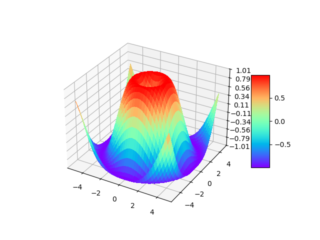

# python 知识点补充
## 输入输出
### print()
- 输出对象：可以是多个
- 分隔符：默认空格，每个对象之间的分隔符
```python
print(1,2,3,4)      # 输出四个对象---1 2 3 4
print([ 1,2,3,4 ])  # 输出一个list对象---[ 1,2,3,4 ]
```
- 结尾符号：默认\n
- 输出文件：默认标准系统输出
- flush：默认false，是否缓存

### str.format() 格式化输出
str里的{}替换format()的参数
- 规律
    - {序号: 填充符 对齐方式 宽度 , .精度 类别}
        - 对齐方式：右对齐>，左对齐<，中间对齐^
        - ,  ：逗号分隔的数字格式，100,000,000
        - 精度：浮点数小数位数，字符串字符数
        - 类别:
            - d十进制
            - x十六进制
            - o八进制
            - b二进制
            - e/E浮点数指数形式
            - f/F浮点数标准形式
            - g/G浮点数最短表示
            - %
- 例子
    - 输出 "Tom,男,40"
    ```python
    # 按顺序
    print('{}，{}，{}'.format('Tom', '男', 40))
    # 按序号
    print('{2}，{1}，{0}'.format(40,'男','Tom'))
    # 按参数名
    -print('{name}，{gender}，{age}' .format(age=40, gender='男', name='Tom'))
    ```
    - :.mf  保留m位小数，默认补0，四舍五入（m>=0）
    - :.m%  百分数，数字部分保留m位小数
    - :.me  科学计数法，数字部分保留m位小数
    - :md   保留m位整数，默认补空格右对齐
    - :c>  右对齐补字符c，默认空格
    ```python
    print("{:x>5d}".format(5))  # "xxxx5"
    print("{:a<5d}".format(5))  # "5aaaa"
    print("{:b^5d}".format(5))  # "bb5bb"
    ```


### input() 读入一个字符串
- 字符串是严格数据可转换
    - int() 将字符串转换成整数 "50" -> 50
    - float() 将字符串转换成浮点数 "5.5" -> 5.5
    - eval() 将字符串当成表达式（单个数据也是表达式）计算 "5 + 5" -> 10
- 输入多个数据：m,n = map(int,input().split())

## 数值类型
### 数值类型
- 整数int
    - 前缀
        - 十进制：无
        - 二进制：0b或0B
        - 八进制：0o或0O
        - 十六进制：0x或0X
    - 符号：在前缀前（-0b0101表示-0101）
- 浮点数float
    - 精度
        - 默认float, 17位
        - decimal, 50位
- 布尔bool
    - True：值为1
    - False：值为0
- 复数complex
    - 虚部：j

### 数值类型转换
- int(对象[, base])：转十进制整数
    - 无参：0
    - 对象为浮点数、非十进制整数，base空：小数直接舍弃
    - 对象为字符串，base指定字符串为多少进制
- float(x)：将字符串转换成浮点数
    - 字符串：数值前后可以有空白符，可以是科学计数法，必须十进制

### 常用函数
- abs()
    - 整数、浮点数返回绝对值
    - 复数，返回它的模
- divmod(a, b)：返回元组(商, 余数) = (a//b, a%b)
- pow(x, y[, z])：x的y次方对z取余
- round(number[, n])：四舍五入
    - n：
        - 空：整数
        - n大于number的位数：直接返回number
        - n小于number位数：四舍五入
    - 5特殊考虑：向偶数舍入，保证最后一位为偶数，由于精度问题可能不能完全按这个规则
    ```python
    print(round(3.1415,3))  # 3.142
    print(round(3.24350,3)) # 3.244
    print(round(3.24450,3)) # 3.244
    ```
- max()：最大值
- min()：最小值
- eval()：计算表达式的值
```python
x=2
print(eval("x + 3"))    # 5
```
- random()随机数：
    - seed(a=None)：初始化随机种子, 让随机数生成是可重复的, 相同的种子生成的
    - random()：生成一个[0.0, 1.0)之间的随机小数
    - randint(a, b)：生成一个[a,b]之间的整数
    - choice(seq)：从序列类型(例如：列表、字符串)中随机返回一个元素
```python
import random
print(random.random())
print(random.randint(1, 10))    # 整数
print(random.uniform(1, 10))    # 小数
print(random.choice(range(10)))
```

## 控制流程
### 条件表达式
- a = x if 条件 else y
    - 条件真：a = x
    - 条件假：a = y

### for循环
- for 取值 in 序列或迭代器:
    - 序列或迭代器：
        - range(开始， 结束， 步长)
            - 范围：[开始，结束)
            - 开始默认0
            - 步长默认1
        - 文件：按行遍历
        - 字符串：按字符遍历
        - 列表：按元素遍历

### else
- else扩展：正常迭代结束才会执行else段
    - for、while相同
    - 非正常结束：break、return、异常终止
    - 正常结束：循环条件变为False退出
```python
# 正常结束：
for i in range(3):
    print(i)
else:
    print("循环正常结束")   # 正常输出

# 非正常结束
for i in range(3):
    if i == 1:
        break
    print(i)
else:
    print("循环正常结束")   # 不输出
```

## 函数
### 参数传递
- 位置传递：按顺序传递
- 关键词传递：参数名传递
- 默认值传递
    - 必须是不可变对象：数值、字符串、元组
    -  不能是可变对象：字典、列表、集合
- 包裹传递：定义函数时不确定有多少参数，可使用包裹传递
    - 参数名之前加 "*"：以元组形式传递值
    ```python
    def test1(*args):
        print(type(args))   # <class 'tuple'>
        print(args)         # (1, 2, 3, 4)
    
    test1(1,2,3,4)
    ```
    - 参数名之前加 "**"：以关键词形式传递值
    ```python
    def test2(**args):
        print(type(args))   # <class 'dict'>
        print(args)         # {'a': 1, 'b': 2, 'c': 2, 'd': 4}

    test2(a=1, b=2, c=2, d=4)
    ```

- 解包裹传递：函数规定好形参，但实际参数为元组或字典类型, 可以解除包裹
    - "*" 元组
    - "**" 字典
    ```python
    def test(a,b,c):
        print(a,b,c)

    t = (1,2,3)
    d = {'a':1, 'b':2, 'c':3}
    test(*t)    # "1 2 3"
    test(**d)   # "1 2 3"
    ```

### 变量作用域
- 局部变量：函数内定义
- 全局变量：函数外定义
    - 函数内使用全局变量用global关键字
    ```python
    n = 1

    def test1():
        n = 2

    def test2():
        global n
        n = 2
    
    test1()
    print(n)    # 1

    test2()
    print(n)    # 2
    ```

### 匿名函数
lambda 参数列表: 表达式
直接赋值给一个变量当函数用，可以传参

- 根据身份证号判断性别
```python
id = input()
gender = lambda id: "女" if int(id[-2])%2==0 else "男"
print(gender(id))
```

- 数组按绝对值排序
```python
ls = [-9, -10, 6, 3, 8]
print(sorted(ls, key=lambda x: abs(x)))
```

## 序列
### 通用序列操作
按照特定顺序排列的一组数据，每个元素都有自己的下标索引
序列类型包括：字符串str、列表list、元组tuple、range、二进制文本类型、生成器generator
- 索引：
    - 正数索引：从序列开头开始，按顺序从0依次编号
    - 负数索引，从序列结尾开始，从-1开始编号
- 切片：获取序列的一部分，生成一个新的序列
    - s[satrt: end: step]
    - 包含start，不包含end
    - start默认0，end默认序列长度，step默认1
    - 可以用负数索引
    - 正向切片：step为正数
    - 逆向切片：step为负数
```python
# 判断回文字符串
s = input()
if s == s[-1::-1]:
    print("True")
else:
    print("False")
```
- 序列相乘：序列*n = 生成新的序列，原序列重复n次
- 序列拼接：序列+序列 = 两个序列拼接
- 成员测试：
    - 是否存在：in
    - 是否不存在：not in
- 内置函数
    - len(): 序列长度
    - max(): 最大值
    - min(): 最小值
    - sorted(): 排序
    - sum(): 求和
    - reverse(): 翻转序列
    - list(): 序列转换成列表
    - str(): 序列转换成字符串
    - ord()：字符转ascii码
    - chr()：ascii码转字符
- 推导式: 通过一个数据序列构建另一个数据序列，列表推导式、字典推导式、集合推导式
    - [表达式 (for 元素 in 序列) if 条件]
        - 将所有符合条件的元素通过表达式转换成新的元素添加到新列表
        - 可以有多个for 元素 in 序列
        ```python
        ls1 = [1,2,3]
        ls2 = [1,3,4]
        ls = [(x,y) for x in ls1 for y in ls2 if x!=y]
        print(ls) # [(1, 3), (1, 4), (2, 1), (2, 3), (2, 4), (3, 1), (3, 4)]
        ```
- 生成器：一边循环一遍计算, 惰性求值
    - 概念：
        - 元素很多时列表占用的空间比较大，如果元素可以按照某算法循环推导出来，就不需要创建完整的列表
        - 生成器对象可以通过__next__()或next()进行编列，也可以当作迭代器对象使用
        - 所有元素访问结束后，生成器对象会变空，想要再次使用必须重新创建
        - 每个遍历过的元素都不在出现
        - 生成器对象不是列表或元组
        - range是惰性求值, 但不是生成器
    - 语法：把推导式最外层[]换成()
    ```python
    g = (i for i in range(10))
    for i in g:
        print(i, end=" ") # 0 1 2 3 4 5
        if i == 5:
            break
    print()
    print(list(g))  # [6, 7, 8, 9]
    print(list(g))  # []
    ```
    - map(f, list)
        - 让函数f作用于list的每一个元素，构成map生成器
    - zip(seq1[, seq2 ...])
        - 取出每个序列第i元素构成元组，作为新序列的第i元素
        - 最短的序列取完后终止
        - 构成zip生成器
        ```python
        ls1 = list(range(10))
        ls2 = list(range(3))
        z = zip(ls1, ls2)
        print(list(z))  # [(0, 0), (1, 1), (2, 2)]
        ```
    - enumerate(seq, start)
        - 为seq的每一个元素添加序号，从start开始计数，默认0开始
        ```python
        ls = ["1", "2", "3"]
        print(list(enumerate(ls, 0)))
        # [(0, '1'), (1, '2'), (2, '3')]
        ```

### 字符串str及其操作
- 字符串常量
    - 字符string.ascii_letters = abcdefghijklmnopqrstuvwxyzABCDEFGHIJKLMNOPQRSTUVWXYZ
    - 小写字符 string.ascii_lowercase = abcdefghijklmnopqrstuvwxyz
    - 大写字符 string.ascii_uppercase = ABCDEFGHIJKLMNOPQRSTUVWXYZ
    - 数字 string.digits = 0123456789
    - 十六进制字符 string.hexdigits = 0123456789abcdefABCDEF
    - 八进制字符 string.octdigits = 01234567
    - 标点符号字符 string.punctuation = '!"#$%&\'()*+,-./:;<=>?@[\\]^_`{|}~'
- 字符串函数：
    - 查询：
        - find(str, start, end): 从左开始查找字符串位置,没找到返回-1。index用法相同，没找到报异常
        - rfind(str, start, end): 从右开始查找字符串位置。rindex同index
    - 大小写操作：
        - upper()：转大写
        - lowwr()：转小写
        - swapcase()：大小写交换
        - capitalize()：首字母大写，其余小写
        - title()：第一个单词首字母大写，其余小写
    - 对齐操作：
        - center(width, 填充字符)：中间对齐
        - ljust(width, 填充字符)：左对齐
        - rjust(width, 填充字符)：右对齐
        - zfill(width)：
    - 分割：
        - split(分隔符, n)：按照分隔符切割n次，即分n+1段，默认空格
        - rsplite：从右边开始
        - splitline：按行分割
        - partition：按照指定字符串分成三份
        - rpartition：从右边开始
        ```python
        s = "my name you name"
        print(s.partition("name")) # ('my ', 'name', ' you name')
        print(s.rpartition("name")) # ('my name you ', 'name', '')
        ```
    - 合并
        - join(序列)：原字符串作为分隔符，将序列拼接成字符串，元素必须是字符串
        ```python
        ls = ['a', 'b', 'c']
        print("---".join(ls)) # a---b---c
        ```
    - 替换
        - replace(old, new, max)：将字符串的old子串替换成new串，最大max次（默认不限次数）
    - 判断：
        - isidentifier：是否是标识符
        - islower：是否是小写
        - isupper：是否是大写
        - startswith：是否以给定字符串开头
        - endswith：是否以给定字符串结尾
    - 去除两端多余字符
        - strip(str)：去除两端**属于**str的字符， 默认空白字符
        - lstrip(str)：去除左边
        - rstrip(str)：去除右边
        ```python
        s = "aaacbcname"
        print(s.lstrip("abc")) # name
        ```
    - 计数
        - count(str, start, end)：记录[satrt, end)范围内str的个数
    
### 列表list及其操作
- 创建：
    - [元素1, ...]
    - list(序列)：将序列转换成列表
    - split()：将序列类型切分为列表，一般为字符串
- 更新：
    - 索引赋值：seq[i]
    - 切片赋值：
        - 连续切片: seq[i:j], 更新的数量可以不同
        ```python
        ls = [1,2,3,4,5,6]
        ls[1:3] = [7,8,9,10]
        print(ls)   # [1, 7, 8, 9, 10, 4, 5, 6]
        ```
        - 不连续切片: seq[i:j:k], 更新的数量必须相同
        ```python
        ls = [1,2,3,4,5,6]
        ls[0::2] = [7,8,9]
        print(ls)   # [7, 2, 8, 4, 9, 6]
        ```
    - append(元素): 末尾添加元素
    - extend(序列): 末尾添加序列
    - insert(i, 元素): 将元素插入位置i
- 删除:
    - pop(): 删除末尾元素
    - remove(元素): 删除第一个元素
    - clear(): 清空
- 排序: 
    - sort(key=None, reverse=False)
        - reverse=True: 翻转,默认升序翻转后为降序
        - key: 指定规则
    - reverse(): 逆序

### 元组
用()存放一组数据，可以通过索引访问
元组是不可变数据类型，不可以增删改元素
可以通过切片访问，但不能修改
- 创建：
    - (元素)
    ```python
    t1 = (1)
    t2 = (1,)
    print(t1)   # 1
    print(t2)   # (1,)
    if t1 == t2:
        print("True")
    else:
        print("False")  # False
    ```
    - 不用括号也行
    ```python
    t1 = 1,
    t2 = (1,)
    print(t1)   # (1,)
    print(t2)   # (1,)
    if t1 == t2:
        print("True")   # True
    else:
        print("False")
    ```
    - tuple(seq)
- 应用：
    - 函数包裹传递
    - 函数多个返回值
    ```python
    def demo():
        return 1,2,3
    a = demo()  
    a1,a2,a3 = a
    print(a)    # (1, 2, 3)
    print(a1,a2,a3) # 1 2 3
    ```
    - 交换数据
    ```python
    a,b = 5,10
    a,b = b,a
    print(a,b)  # 10 5
    ```

### 集合
无序不重复
**可变**的数据类型
不支持索引和切片

- 创建: 可以自动去重
    - set(seq)
    - {元素/推导式}: 不能用此方法创建空集
- 操作:
    - update(seq): 原集合并上seq
    - add(元素): 添加
    - remove(元素): 删除元素
    - disacrd(元素): 删除元素
    - pop(): 随机删除
    - clear(): 清空集合
- 集合关系:
    - s包含t:
        - s.issuperset(t)
        - s > t: 真包含
        - s >= t
    - t含于s:
        - t.issubset(s)
        - t < s: 真子集
        - t <= s
    - s等价t
        - s == t
    - s 与 t 无交集
        - s.isdisjoint(t)
- 集合运算:
    - 并集:
        - s.union(t)
        - s | t
    - 交集:
        - s.intersection(t)
        - s & t
    - 差集:
        - s.difference(t)
        - s - t
    - 对称差/异或:
        - s.symmetric_difference(t)
        - s ^ t

### 字典
无序可变, 元素是键值对
键不可重复, 必须是不可变数据类型

- 创建: 相同键, 保留最后一次的值
    - {}: 可以用此方式创建空字典
        - {键:值}
        - {推导式}
    - dict(): 
        - dict(键:值)
        - dict([(键,值)])
        - dict(zip([seq1, seq2]))
    - dict.fromkeys(seq, value): 序列元素为键,值都为value, 默认None
- 访问
    - dict[key]: 不存在key会报错
    - get(key, default): 存在key返回对应值,不存在返回default, 默认为none
    - keys(): 获取所有键
    - values(): 获取所有值
    - items(): 获取所有键值对, 元组形式
- 修改:
    - dict[key]赋值: 有相同键修改值, 无则添加
    - update(): 有相同键修改值, 无则添加
        - 可以传入字典 元组列表 等, 同创建
    - detdefault(key, value): 存在key返回值(不修改),不存在创建键值对
    - pop(key, default): 存在key删除键值对并返回值; 不存在返回default
    - popitem(): 删除最后一个键值对, 并返回
    - clear(): 清空

## 文件操作
### 概述
- 保存形式
    - 文本文件
        - 文本 txt
        - 逗号分割值 csv
        - 日志 log
        - 配置文件 ini

    - 二进制文件: 以二进制形式存放数据，读取需要能够解析二进制数据结构和含义的应用软件
        - 图片 jpeg
        - 视频 mpeg
        - 可执行文件 exe

    - 外部存储器

### 文件操作

- 打开文件
    - 打开方式
        - r 只读：默认
        - w 写：没有文件会创建，有文件会清空
        - x 创建文件写：有文件会报错，没有文件会创建
        - a 追加：没有文件会创建，有文件会在数据末尾开始写
        - b 二进制
        - t 文本：默认
        - + 增加读写模式：r+可写、w+可读
    - 编码方式：非二进制时可填
        - utf-8 常用
        - gbk
```python
with open(文件路径, 打开方式mode, 编码方式encoding) as 别名:
```

- seek(偏移量，参照物)：回到期望位置
    文件打开时指针指向文件开头，随着遍历向后移动位置，想要回看之前的数据，可以用seek方法
    - seek(0): 文件开头
    - seek(1): 当前位置
    - seek(2): 文件末尾

- 读取文件
    - read(size)：
        - 返回字符串
        - size: 读取字符数
        - size空或者-1时表示读取全部
    - readline(size): 
        - 返回字符串
        - size: 读取当前行最多前size个字符
        - size空或-1表示读取一行
    - readlines(hint):
        - 返回列表
        - hint：读取第hink+1个字符所在行以及以前的所有行，每行一个元素（包含换行符）
        - hink空表示读取全部
    
- 写文件
    - write(): 将给定的字符串或字节流对象写入文件
    - writelines(): 将字符串列表写入文件

### csv文件
csv文件用于数据文件的输入输出
以纯文本的形式存储表格数据
每行一条记录
字段由字符串或字符分隔
用 ','.join(s) 写入

### json格式文件
跨语言的通用数据交换格式
文本格式
key必须是双引号的字符串

- json操作
    - json.dumps(obj): 将pyhton数据转换成json字符串
        - 格式化：indent表示缩进空格数
    - json.dump(obj, fp): 将pyhton数据转换成json字符串, 并存入文件
    - json.loads(s): json字符串转python数据对象
    - json.load(s,fp): json文件转python数据对象

## 数据分析与可视化

### numpy
科学计算处理库
进行矩阵运算、矢量处理、数据变换

- 功能
    - 读写磁盘上基于数组的数据集进行线性代数运算
        - 傅里叶变换
        - 随机数生成
    - 将其他语言代码集成到pyhton作为算法之间数据传递的容器
    - 其他语言编写的库可以直接使用numpy数组的数据
- numpy数组的基本属性
    - 秩：数组的维数，例如二维数组秩为2
- ndarray 多维数组：
    - 说明
        - 存储单一数据类型
        - 高效存储大量数值数据
        - 提高数组运算速度
    - 创建
        - np.array(seq, dtype=int)：列表转为数组，会进行数据类型转换
        - reshape(m,n)：数组重建为m行n列
        - np.arange(start, end, step): 开始默认0，步长默认1
        - np.linspace(start, end, n): 等差数组，元素个数n，默认50
        - np.logspace(start, end, n, base=10): 等比数列, 开始结尾为指数部分，底数base
        - np.random.rand(m,n): 随机m行n列的矩阵
        - np.ones(m,n): m行n列的矩阵全1矩阵
        - np.zores(m,n): m行n列的矩阵全0矩阵
        - 三角函数
    - 支持索引和切片
    ```python
    import numpy as np
    # np数组支持多维切片
    ls1 = np.array([[1,1,1],[2,2,2],[3,3,3]])
    print(ls1[0:2, 0])  # [1 2]
    # list不支持
    ls2 = [[1,1,1],[2,2,2],[3,3,3]]
    print(ls2[0:2, 0]) # 报错
    ```
- ufunc 统一函数对象
    - 说明
        - 对数组进行元素级运算以及直接对数组进行数学运算
        - 以numpy数组作为输出
    - 运算函数
        - np.add(a,b) 或 a+b: 对应位置相加
        - np.multiply(a,b) 或 a*b: 对应位置相乘
        - np.divide(a,b) 或 a/b: 除
        - np.floor_divide(a,b) 或 a//b: 整除
        - np.mod(a,b) 或 a%b: 取余
        - a**2: 每个元素平方
        - a%3: 每个元素对3取模
        - np.exp(a): 每个元素e的a[i]次幂
        - np.aprt(a): 每个元素开方
        - np.square(a)：每个元素平方
    - 统计函数：
        - sum 求和
        - min最小值，argmin最小值索引
        - max最大值，argmax最大值索引
        - cumsum所有元素相加
        - mean均值 std标准差 median中位数 var方差
    - 读取文件中的数据 
        - getfromtxt(fname文件, dtype数据类型, delimiter分隔符, sfip_header跳过行数, usecols读取哪些列, encoding)
        - loadtxt 不考虑缺失值
    - 保存文件
        - savetxt

### matplotlib
2D绘图库

#### 折线图
plt.plot(x,y)  x是横轴序列，y纵轴序列
plt.show() 显示绘图结果
增加点的数量使图平滑

- 属性
    - 线条linestyle
        - "-"实线
        - "--"虚线
        - ":"点线
        - "-."点划线
    - 颜色对应英文color
    - 打点marker
    - 标签
        - title()标题 
        - legend()图注位置
        - annotate(str, (x,y)) 给(x,y)点注释
        - xlabel()x轴标签、ybabel()y轴标签
        - xticks()x轴刻度、yticks()y轴刻度
        - fontproperties参数：指定字体
    - rc参数：自定义图形默认值
        - plt.rcParams["font.sans-serif"] = ["simHei"]  # 指定字体
        - plt.rcParams["axes.unicode_minus"] = False 解决负号显示方块问题
    - 坐标轴与直线
        - xlim(min, max) x轴范围，y同理
        - axhline(x, ymin, ymax)绘制水平线
        - axvline(x, ymin, ymax)绘制垂直线
    - 填充
        - axhspan()水平区域，axvspan()垂直区域
        - fill_between()填充两条曲线围起来的区域，区间横坐标限定
        - fill_betweenx()填充两条曲线围起来的区域，区间纵坐标限定
    - 多子图绘制
        - plt.subplot(m,n,index) 把图拆除m*n的区域，选择第index的区域画子图
    - 保存图片文件
        - plt.savefig(文件名) 在show()之前，需要pip install piliow

#### 饼图

plt.pie(数据数组, )
- 参数
    - explode 需要突出展示的数据位置及突出量，与数据列表一一对应，小数
    - labels 各部分的标签
    - labeldistance 文本的位置，到原点的距离与半径的比值
    - autopct 饼图的文本格式，例如%2.1f%%表示整数2，小数1位
    - shadow 是否有阴影
    - startangle 起始角度，逆时针，一般从90开始
    - pctdistance：文本离圆心的距离相对半径的百分比。
        
#### 直方图
plt.hist(数据数组, )
- 参数
    - bins：区间数量，整数
    - normed：布尔型，是否将频数转换成频率
    - histtype：类型，'bar'、'barstacked'、'step'、 'stepfilled'
        - 'bar' 多组数据时，水平并列排放。
        - 'barstacked' 多组数据时，垂直堆叠摆放。
        - 'step' 线型轮廓图不填充。
        - 'stepfilled' 产生线型轮廓图填充缺省颜色。
    - orientation：可设为horizontal或vertical，水平或竖直
    返回值：
    - n：数组或数组的列表，其值为落在每个区间的频度(数量)
    - bins：一个数组，值为划分的区间的边界数字
    - patches：用于创建直方图补充参数列表

#### 散点图
plt.scatter(x序列, y序列, )
- 参数
    - c颜色
    - marker 点的形式，默认为原点
    - degecolors 轮廓颜色

#### 等值线
plt.contour() 函数绘制等值线
contourf() 函数绘制填充等值线

#### 三维图像
建立三维画布
多输入一维
```python
import matplotlib.pyplot as plt
from matplotlib import cm
from matplotlib.ticker import LinearLocator
import numpy as np
def plot_3d():   
    fig, ax = plt.subplots(subplot_kw={"projection": "3d"})    
    x = np.arange(-5, 5, 0.25)  # 定义x, y
    y = np.arange(-5, 5, 0.25)    
    X, Y = np.meshgrid(x, y)  # 生成网格数据    
    R = np.sqrt(X ** 2 + Y ** 2)  # 计算每个点对的长度
    Z = np.sin(R)  # 计算Z轴的高度    
    surf = ax.plot_surface(X, Y, Z, cmap=cm.rainbow, linewidth=0, antialiased=False)    
    ax.set_zlim(-1.01, 1.01)  # 设置z轴的维度
    ax.zaxis.set_major_locator(LinearLocator(10))
    ax.zaxis.set_major_formatter('{x:.02f}')
    fig.colorbar(surf, shrink=0.5, aspect=5)  # 绘制映射颜色值的色柱
    
if __name__ == '__main__':
    plot_3d()
    plt.show()
```


#### 曲线拟合
scipy.optimize.curve_fit()
返回值包含拟合曲线的系数 ret[0]

- 参数
    - f拟合的函数类型
    - xdata, ydata：拟合点的坐标数组


### pandas
分析结构化数据的工具集

#### 数据结构
- Series
    - 说明
        - 一维数据结构，可以保存任何数据类型
        - 索引可以是数字或字符串
        - 由索引列和数据列组成
    - pd.Series(data, index, dtype, name, copy)
        - data: 数据列  .values获取 
        - index: 默认从0开始    .index获取
        - dtype：数据类型，默认会自己判断
        - name: 设置名称
        - copy：是否拷贝数据， 默认False
    - 可以用字典构造，键为索引 pd.Series(dict)
    - 支持索引、切片
- DataFrame
    - 说明
        - 二维数据结构，excel表
        - 两个索引数组index和columns
        - 可以看成由series组成的字典，键为列名
    - pd.DataFrame(data, index, columns, dtype, copy)
        - data: ndarray、series、map、lists、dict
    - 数据查看
        - df[列索引] 或者 df.列索引：访问列
        - df.loc[行索引]：访问行，标签
        - df.iloc[行索引]：访问行，从0开始，支持切片

#### 数据操作
- sum对象求和：对每列/行求和，axis=1行、0列
- cumsum累计求和：x[i][j] += x[i-1][j]
- idxmax行名称最大值、idxmin最小值
- 去重
    - unique，去掉series对象的重复着，返回numpy数组
    - value_counts，返回series对象，统计每个元素的出现次数，.index可以获取去重后的元素
- isin(list)比较元素是否属于给定的list,返回布尔矩阵
- 支持数学运算，同numpy
    - 数据对齐，通过补NaN对齐
- 增加数据
    - 同字典索引赋值, 在原数据上加
    - append(series, index) 返回新矩阵，原矩阵不变
- 删除
    - del df[ind]
    - df.pop(ind)
- 查找
    - df[条件]基于条件筛选
    - 支持索引查找
- 文件操作
    - csv: read_csv(路径, sep, names, encoding)
    - txt: read_table(路径, sep, names, encoding)
    - excel: read_excel(路径, sep, names, encoding)

### jieba
中文文本需要通过分词获得单个单词
利用中文词库，确定中文字符之间的关联概率
概率大的组成词组，形成分词结果
用户还可以自定义词组

- 分词模式jieba.lcut(s)
    - jieba.lcut(s) 精确模式：精确切割成若干单词，没有冗余，可以还原原文本
    - jieba.lcut(s, cut_all=true) 全模式：按照各个可能的组合切割，会有冗余
    - jieba.lcut_for_search(s) 搜索引擎模式：精确模式基础上，对长单词进一步切割，有冗余

### wordcloud词云
- 根据词频生成词云
    - fit_words(frequencies)
    - generate_from_frequencies(frequencies)
- 根据文本生成词云
    - generate(text)
    - generate_from_text(text)
- process_text(text) 长文本分词取出stopwords, 返回词频字典
- recolor() 重着色
- to_array() 转为numpy数组
- to_file() 导出为图片文件


## 面向对象

### 封装
#### 访问控制
- 属性访问权限
    - _xx视为私有变量，实际可以直接访问
    - __xx为私有变量，但是可以通过 _类名__xx访问
- 内置特殊方法
    - __init__初始化
    - __del__删除
    - __str__转字符串

#### 属性
- 类属性：类内方法外定义
    - 静态变量，所有实例共有，可通过类名访问
- 实例属性：类内方法内，self.xx定义
    - 变量名访问
- 局部变量：类内方法内定义

### 方法
- 实例方法：第一个参数为实例对象，约定为self
    - 实例调用，不需要传self
- 类方法：第一个参数为类对象，约定为cls，需要@classmethod修饰
    - 实例或类调用
    - 不需要传cls
- 静态方法：不需要self、cls，需要@staticmethod修饰
    - 方法体不能使用任何实例或类的方法和属性
    - 实例或类调用

### 继承
- 子类不会自动调用父类的init，需要手动调用
- 基类名.方法名(self, ....)，需要传self
- 重写：子类定义与父类相同的属性方法，调用时走子类的
- 多继承：一个类可以继承多个父类，属性方法按继承的顺序排
```python
class A:
    def show(self): pass

class B:
    def show(self): pass

class D(A, B): pass

d = D()
d.show() # 调用A的show
```


