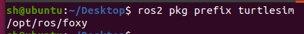
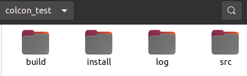
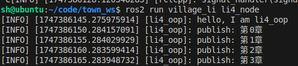
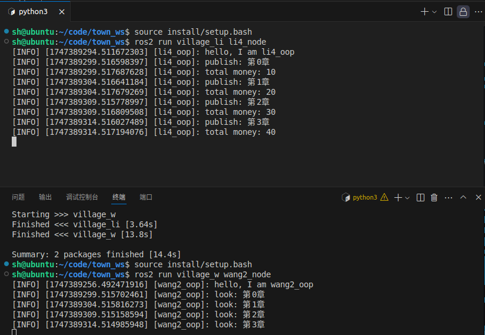

# ros2学习笔记

## 00 ros初体验
### 你说我听

启动两个节点一个负责发消息，一个负责接收消息

- 倾听者
```bash
ros2 run demo_nodes_py listener
```

- 说话者
```bash
ros2 run demo_nodes_cpp talker
```

说话者不断发送消息，倾听者输出收到的消息


### 涂鸦乌龟

启动海龟模拟器、海龟遥控器，控制海龟在地图上画出任意轨迹

- 启动海龟模拟器
```bash
ros2 run turtlesim turtlesim_node
```


- 启动海龟控制器
```bash
ros2 run turtlesim turtle_teleop_key
```
启动后可以通过上下左右键控制海龟移动


**注意**本地vscode通过ssh连接虚拟机，想要运行图形化界面需要配置x反向转发
在VSCode的Remote SSH配置中，添加以下参数：
```
Host name
    RemoteForward 6000 localhost:6000
```
在本地VSCode终端中运行：
```bash
export DISPLAY=:0
```

## ros基础概念

### 节点

#### 节点概念
每个节点负责一个单独的模块化的功能
比如一个机器人包含摄像机模块、导航模块、驱动模块、操作模块等


#### 节点通信
模块间需要交互传递数据，就需要通信功能
节点间通信方式：
- 话题-topics
- 服务-services
- 动作-Action
- 参数-parameters


#### 节点常用的CLI

- 启动节点
```bash
ros2 run 包名 可执行文件名
```
含义：启动功能包下的节点

- 查看节点列表
```bash
ros2 node list
```
含义：查看当前正在运行的节点列表


- 查看节点信息
```bash
ros2 node info node_name
```
含义：查看节点的发布话题、订阅话题、服务等


- 重映射节点名称
```bash
ros2 run 包名 可执行文件名 --ros-args --remap __node:=新名称
```
含义：给节点重新命名


### 工作空间
一个工作空间有多个功能包，一个工作包有多个节点

#### 工作空间
工作空间是若干个功能包的目录，可以理解为文件夹，文件夹里有src目录，存放各个功能包
所以创建工作空间命令：
```bash
mkdir -p workspace_name/src
```

#### 功能包
存放各个节点的地方，根据编译方式分为三种类型：
- ament_python：适用于python程序
- cmake：适用于c++
- ament_cmake：适用于c++，cmake增强版

#### 安装获取功能包
- 直接安装
    ```bash
    sudo apt install ros-verion-package_name
    ```
    version：ros版本，Foxy、Galactic、Rolling
    自动放到系统目录（opt/ros/verion/），不需要source

- 手动编译获取
下载源码，手动编译成相关文件
当需要修改源码的时候，可以手动编译
编译完后需要source工作空间的install目录

#### 功能包相关指令
- 创建功能包
```bash
ros2 pkg create 包名  --build-type  {cmake,ament_cmake,ament_python}  --dependencies 依赖名字
```

- 列出可执行文件
列出所有可执行文件
```bash
ros2 pkg executables
```


列出某个功能包的可执行文件
```bash
ros2 pkg executables 包名
```


- 列出所有包
```bash
ros2 pkg list
```


- 列出某个包路径前缀
```bash
ros2 pkg prefix 包名
```



- 列出包的清单描述文件
```bash
ros2 pkg xml 包名
```
每个功能包有一个manifest.xml文件，记录包的名字、构建工具、编译信息、拥有者、依赖等


### colcon构建工具

#### colcon工具安装使用

功能包构建工具，用于编译代码

- 安装colcon
ros2默认没有安装
```bash
sudo apt-get install python3-colcon-common-extensions
```

- 编译发布订阅节点
创建测试工作空间
```bash
mkdir colcon_test && cd colcon_test
mkdir src
```

下载实例代码
```bash
git clone https://github.com/ros2/examples src/examples -b foxy
```

编译
```bash
colcon build
```


编译完成后目录结构
```
.
├── build
├── install
├── log
└── src
```
    - build：存储中间文件，每个包创建一个子文件夹，调用编译工具
    - install：每个软件包安装的位置，每个包安装到单独的子文件中，seyup.bash文件
    - log：每个colcon调用的日志信息
    - src：源代码存储位置



运行编译好的代码
订阅者
```bash
source install/setup.bash
ros2 run examples_rclcpp_minimal_subscriber subscriber_member_function
```

发布者
```bash
source install/setup.bash
source install/setup.bash
ros2 run examples_rclcpp_minimal_publisher publisher_member_function
```


#### colcon常用指令

- 只编译一个包
```bash
colcon build --packages-select 包名 
```


- 运行编译的包的测试
```bash
colcon test
```

- 运行通过更改src下的部分文件来改变install

```bash
colcon build --symlink-install
```

### 用python写一个作家节点

创建工作空间和功能包
```bash
mkdir -p town_ws/src
cd town_ws/src
ros2 pkg create village_li --build-type ament_pyhton --dependencies rclcpy
```


#### 面向过程方式
在town_ws/src/village_li/village_li下创建li4.py
基本五步
```python
# 1 导入库文件
import rclpy
from rclpy.node import Node

# 入口函数
def main(args=None):

    # 2 初始化客户端库
    rclpy.init(args=args)

    # 3 新建节点对象
    # ros2 ndoe list展示的名字
    li4_node = Node("li4")

    # 日志信息
    li4_node.get_logger().info("hello, I am Li4")

    # 4 spin循环节点
    rclpy.spin(li4_node)

    # 5 关闭客户端
    rclpy.shutdown()
```

在town_ws/src/village_li/setup.py中配置
```python
    entry_points={
        'console_scripts': [
            "li4_node=village_li.li4:main" # 添加该代码
        ],
    },
```

在town_ws下编译，source并运行
```bash
colcon build
source install/setup.bash
ros2 run village_li li4_node
```


查看节点信息
```bash
ros2 node list
ros2 node info /li4
```


#### 面向对象
修改li4.py
```python
import rclpy
from rclpy.node import Node

class WriteNode(Node):
    def __init__(self, name):
        super().__init__(name)
        self.get_logger().info(f"hello, I am {name}")

# 入口函数
def main(args=None):

    # 初始化客户端库
    rclpy.init(args=args)

    # 新建节点对象
    li4_node = WriteNode("li4_oop")

    # spin循环节点
    rclpy.spin(li4_node)

    # 关闭客户端
    rclpy.shutdown()
```

编译运行后效果一样

### 用c++写一个读者节点
在town_ws工作空间创建功能包
```bash
cd town_ws/src
ros2 pkg create village_w --build-type ament_cmake --dependencies rclcpp
```


#### 面向过程
在town_ws/src/village_w/src下创建wang2.cpp
```c++
// 导入库文件
#include "rclcpp/rclcpp.hpp"

int main(int argc, char ** argv){
    // 初始化客户端库
    rclcpp::init(argc,argv);
    // 新建节点对象
    auto node = std::make_shared<rclcpp::Node>("wang2");
    RCLCPP_INFO(node->get_logger(), "hello, I am wang2");
    // spin循环节点
    rclcpp::spin(node);
    // 关闭客户端
    rclcpp::shutdown();
}
```

配置
town_ws/src/village_w/CMakeLists.txt
```
add_executable(wang2_node src/wang2.cpp)
ament_target_dependencies(wang2_node rclcpp)

install(TARGETS
  wang2_node
  DESTINATION lib/${PROJECT_NAME}
)
```

编译运行
```bash
colcon build --packages-select village_w
source install/setuo.bash
ros2 run village_w wang2_node
```


#### 面向对象
修改wang2.cpp
```cpp
class WangNode: public rclcpp::Node
{
public:
    WangNode(std::string name): Node(name)
    {
        RCLCPP_INFO(this->get_logger(), "hello, I am %s", name.c_str());
    }
};

int main(int argc, char ** argv){
    rclcpp::init(argc,argv);
    auto node = std::make_shared<WangNode>("wang2_oop");
    rclcpp::spin(node);
    rclcpp::shutdown();
}
```


## ros通信机制 - 话题与服务
### 话题
#### 话题模型
话题采用订阅发布模型

一对一模型


一对N


N对1


N对N


订阅自身


#### 话题工具
- GUI: ROT(rqt_graph)
可以查看节点和节点之间的数据关系

例如 你说我听demo
```bash
ros2 run demo_nodes_py listener
ros2 run demo_nodes_cpp talker
rqt_graph
```


- CLI命令
返回所有主题列表
```bash
ros2 topic list [-t]
```
选项-t表示添加消息类型


打印话题内容
```bash
ros2 topic echo 话题
```


查看主题信息
```bash
ros2 topic info 话题
```


手动发布消息
```bash
ros2 topic pub 话题 消息类型 '消息'
```


#### 用python编写话题
##### 发布者
补充li4.py
```python
# 1 导入数据类型
from std_msgs.msg import String

class WriteNode(Node):
    def __init__(self, name):
        super().__init__(name)
        self.get_logger().info(f"hello, I am {name}")
        # 2 创建发布者（消息类型，话题名，队列大小）
        self.pub_novel = self.create_publisher(String, "novel", 10)
        self.count = 0
        self.timer_period = 5
        self.timer = self.create_timer(self.timer_period, self.timer_callback)
    
    def timer_callback(self):
        # 3 编写发布逻辑发布数据
        msg = String()
        msg.data = f"第{self.count}章"
        self.pub_novel.publish(msg)
        self.get_logger().info(f"publish: {msg.data}")
        self.count += 1
```

重新编译运行


查看话题并捕获


##### 订阅者
补充li4.py
```python
class WriteNode(Node):
    def __init__(self, name):
        # ...

        self.account = 0
        # 创建订阅者(消息类型， 话题名， 回调，队列大小)
        self.submoney = self.create_subscription(UInt32, "make_money", self.recv_money_callback, 10)

    def recv_money_callback(self, money):
        # 订阅处理函数
        self.account += money.data
        self.get_logger().info(f"total money: {self.account}")
```

重新编译运行
发布消息给订阅者


订阅者接收


#### 用c++实现话题
##### 订阅者
修改wang2.cpp
```cpp
#include "std_msgs/msg/string.hpp"
#include "std_msgs/msg/u_int32.hpp"

// 占位符
using std::placeholders::_1;
using std::placeholders::_2;

class WangNode: public rclcpp::Node
{
private:
    // 3 声明订阅者 
    rclcpp::Subscription<std_msgs::msg::String>::SharedPtr sub_novel;

    // 2 创建回调函数
    void novel_callback(const std_msgs::msg::String::SharedPtr msg){
        // 4 回调处理逻辑
        RCLCPP_INFO(this->get_logger(), "look: %s", msg->data.c_str());
    }

public:
    WangNode(std::string name): Node(name)
    {
        RCLCPP_INFO(this->get_logger(), "hello, I am %s", name.c_str());
        // 3 创建订阅者
        //std::bind()用于绑定回调函数
        sub_novel = this->create_subscription<std_msgs::msg::String>("novel", 10, std::bind(&WangNode::novel_callback, this,_1));
    } 
};
```

编译运行li4_node和wang2_node


##### 发布者
修改wang2.cpp
```cpp
class WangNode: public rclcpp::Node
{
private:
    // ...
    // 声明发布者
    rclcpp::Publisher<std_msgs::msg::UInt32>::SharedPtr pub_money;

    void novel_callback(const std_msgs::msg::String::SharedPtr msg){
        // 发布逻辑
        std_msgs::msg::UInt32 money;
        money.data = 10;
        pub_money->publish(money);

        // 4 回调处理逻辑
        // ...
    }

public:
    WangNode(std::string name): Node(name)
    {
        // ...

        // 创建发布者
        pub_money = this->create_publisher<std_msgs::msg::UInt32>("make_money", 10); 
    }
};
```

编译运行



### 通信接口

#### 接口常用的命令

查看某个接口包下的所有接口
```bash
ros2 interface package 接口包
```

查看接口列表
```bash
ros2 interface list
```

查看接口详细信息
```bash
ros2 interface show 接口
```


#### 自定义接口
话题、服务、动作都可以自定义接口

在town_ws/src下创建接口功能包
```bash
ros2 pkg create village_interface 
```

在town_ws/src/village_interface下创建消息文件msg/Novel.msg
```
# 字符串
string content
# 图片
sensor_msgs/Image image 
```

修改CMakeLists.txt
```
# 补充
find_package(sensor_msgs REQUIRED)
find_package(rosidl_default_generators REQUIRED)

# ...

rosidl_generate_interfaces(${PROJECT_NAME}
  "msg/Novel.msg"
  DEPENDENCIES sensor_msgs
)

ament_package()
```

修改xml文件
```xml
  <buildtool_depend>ament_cmake</buildtool_depend>

  <depend>sensor_msgs</depend>
  <build_depend>rosidl_default_generators</build_depend>
  <exec_depend>rosidl_default_runtime</exec_depend>
  <member_of_group>rosidl_interface_packages</member_of_group>

  <test_depend>ament_lint_auto</test_depend>
```

编译并查看接口信息
```bash
colcon build --packages-select village_interfaces
source install/setup.bash
ros2 interface package village_interfaces
ros2 interface show village_interfaces/msg/Novel
```


